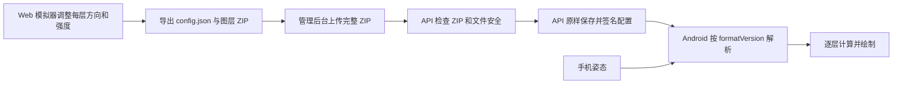

# ARC-003 4D 分层视差壁纸原理

**版本：** 2.1

**日期：** 2026-09-16

**适用范围：** 倾境壁纸 Android `LAYER_PARALLAX`、Web 4D 模拟器和素材制作。

## 1. 产品模型

4D 是产品名称，当前技术是由手机姿态驱动的二维分层视差。每张图仍是平面图片；不同图层按配置的方向和距离移动后，遮挡关系发生变化，从而产生纵深感。

二层场景使用一张透明前景和一张完整背景：

- 手机向左时，前景跟随向左，背景反向向右。
- 手机向右时，前景跟随向右，背景反向向左。
- 手机向下时，前景跟随向下，背景反向向上。
- 手机向上时，前景跟随向上，背景反向向下。
- 手机回到开始监听时的中立姿态，两层回到中心。

多层场景不由程序猜测方向。制作人员在 Web 模拟器里为每层选择 `direction` 并调整 `offsetPercent`，实时观察效果后导出；Android 按同一配置播放。

## 2. 参数与公式

v2 使用一个全局满幅角度和每层方向/强度：

- `motion.maxAngle`：达到最大位移所需的相对倾斜角，范围 `1°～75°`；从 0° 开始响应，没有启动死区。
- `layer.offsetPercent`：`0～100` 的位移强度。
- `layer.direction`：`follow` 跟随、`reverse` 反向、`fixed` 固定。
- 最大安全位移为屏幕对应轴长的 `15%`。强度 100 对应 15%，强度 50 对应 7.5%。

设相对中立姿态的倾斜角为 `angle`：

```text
input = clamp(angle / maxAngle, -1, 1)
directionSign = follow ? 1 : reverse ? -1 : 0
travel = offsetPercent / 100 × 0.15

水平位移 = 水平 input × 屏幕宽度 × travel × directionSign
垂直位移 = 垂直 input × 屏幕高度 × travel × directionSign
```

左右和上下使用同一层强度。传感器噪声使用 App 内部固定平滑处理，不进入素材配置。v2 不使用 `depth`、`strength`、`responseCurve` 或 `responseGain`。

### 二层示例

```text
前景 55% / follow
背景 20% / reverse
```

满幅时实际移动分别约为屏幕轴长的 8.25% 和 3%。未达到 `maxAngle` 时按角度线性缩放；0° 位移为 0。

### 多层示例

```text
01 碎片前景    100% / follow
02 光效层       33% / follow
03 人物层       33% / follow
04 中间建筑      0% / fixed
05 完整背景     20% / reverse
```

这些是制作结果。图层编号只决定遮挡顺序，不决定运动方向。

## 3. 图层、透明度和显示边界

源包支持 2～12 层，`01` 是最前景，最后编号是完整背景。Android 从最后一层向 `01` 绘制。所有图层使用相同像素画布和坐标；前景保留透明通道，最后背景完整不透明。

前景移动后空出的区域由下层显示。背景移动时可能露出画布边缘，Android 和 Web 按实际最大位移计算最低显示放大：

```text
实际满幅位移比例 = offsetPercent / 100 × 0.15
背景最低显示倍数 = 1 + 2 × 实际满幅位移比例
```

例如背景为 `20% / reverse`，实际满幅位移为屏幕轴长 3%，最低显示倍数为 `1.06`。超出屏幕的部分只在绘制时裁掉；源图片文件和解码分辨率不变。配置中的 `scale` 可以提供更大的艺术构图放大。

`opacity` 与素材自身透明度共同生效；`blendMode` 支持 `normal`、`screen` 和 `add`，只负责图层合成。

## 4. 配置所有权和交付链路



Web 模拟器和 Android 共同拥有算法契约。API 不判断方向、强度关系或艺术效果，不把配置转换成另一套内部字段。正式签名包中的 `PARALLAX_CONFIG` 与上传 ZIP 中的 `config.json` 保持相同字节。

API 仍检查 ZIP 解压安全、固定目录、文件数量和大小、图层连续编号、图片可解码、尺寸一致、前景透明和背景不透明。这些是资源文件安全，不是效果算法。

受限防盗预览可以使用降分辨率和水印派生图层；正式下载和设置使用原始图层。若预览图层尺寸变化，只允许同步结构性的画布尺寸，不能修改运动参数。

## 5. v2 配置

```json
{
  "formatVersion": 2,
  "canvas": { "width": 2048, "height": 2048 },
  "motion": { "maxAngle": 75 },
  "layers": [
    { "index": 1, "offsetPercent": 55, "direction": "follow", "scale": 1.18, "opacity": 1, "blendMode": "normal" },
    { "index": 2, "offsetPercent": 35, "direction": "follow", "scale": 1.18, "opacity": 1, "blendMode": "normal" },
    { "index": 3, "offsetPercent": 20, "direction": "reverse", "scale": 1, "opacity": 1, "blendMode": "normal" }
  ]
}
```

完整 Schema 见 [`parallax-source-v2.schema.json`](../../packages/wallpaper-format/parallax-source-v2.schema.json)。产品尚未正式上线，Web、API 和 Android 统一只使用当前 v2，不保留旧带符号位移或 v1 `depth/strength` 分支。

## 6. Android 运行边界

- 优先读取 `TYPE_GAME_ROTATION_VECTOR`，不可用时使用 `TYPE_ROTATION_VECTOR`；开始监听和屏幕旋转后重新建立中立姿态。
- 正式图层按源尺寸、ARGB_8888 解码，固定 `inSampleSize=1` 并禁用密度缩放；不静默降采样。
- 加载前为运行时保留至少 16 MiB 堆余量，资源超过设备能力时明确失败，不降低清晰度兜底。
- 绘制频率最高约 30 fps；壁纸不可见或 Surface 销毁后注销传感器并释放位图。
- App 在安装签名包时按 `formatVersion` 检查自己能安全执行的字段和范围。该检查属于客户端运行安全，不由 API 复制实现。

## 7. 验收标准

1. 满幅 75°、强度 100% 时实际位移为屏幕轴长 15%；37.5° 时为 7.5%；0° 时为 0。
2. 同一强度切换 follow/reverse 时方向立即反转；fixed 或 0% 不移动。
3. 同一 v2 配置在 Web 和 Android 上的图层顺序、方向和满幅位移一致。
4. 背景达到最大位移时不露边；显示放大不改变源图字节和解码分辨率。
5. API 收到未知算法字段的配置仍能原样导入和下发，参数演进不要求 API 改版。
6. 旧配置被拒绝，链路中不产生 `depth/strength/responseCurve/responseGain`。

## 8. 配套资料

- [Web 模拟器配合方案](../01-产品需求/IXD-WP-SIM-001-4D签名位移模拟器配合方案.md)
- [API 与管理后台改造方案](../04-接口设计/API-008-4D配置透传与管理后台改造方案.md)
- [4D 源包制作说明](../../packages/wallpaper-format/4D源包制作说明.md)
- [Android 配置解析](../../packages/wallpaper-android/android/src/main/kotlin/com/qingjing/wallpaper_android/playback/ParallaxConfiguration.kt)
- [Android 位移计算](../../packages/wallpaper-android/android/src/main/kotlin/com/qingjing/wallpaper_android/playback/ParallaxMotion.kt)
