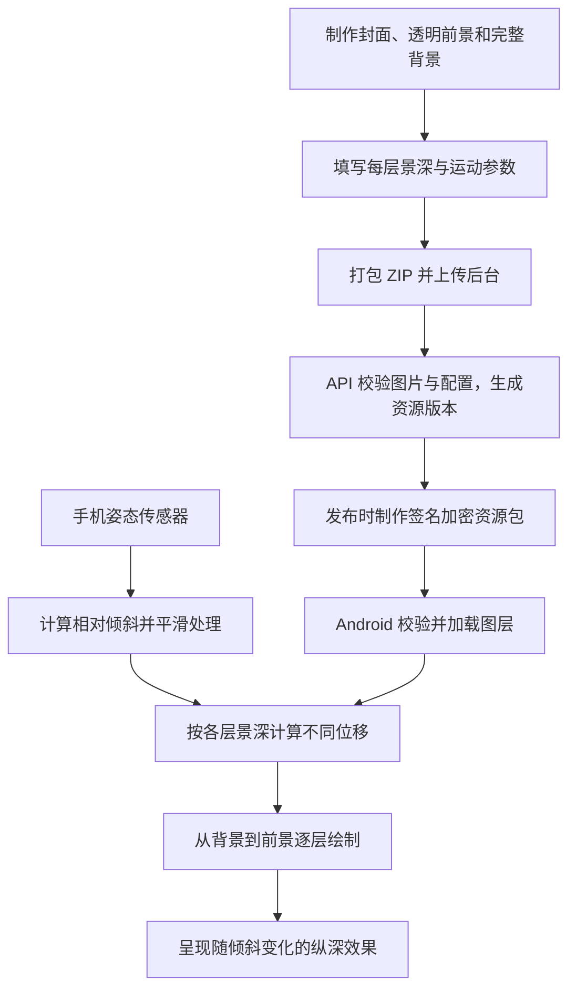

# ARC-003 4D 分层视差壁纸原理

**版本：** 1.0

**日期：** 2026-09-15

**适用范围：** 倾境壁纸当前 Android `LAYER_PARALLAX` 实现，供产品、素材设计和开发共同使用。

## 1. 一句话理解

把一幅画拆成多张有前后关系的图片，像几片透明玻璃一样叠起来。手机倾斜时，让近处图层移动得多、远处图层移动得少，眼睛就会感觉画面有纵深。

例如山景可以拆为：近处树枝、中间山峰、远处天空。三张图片分别移动时，树枝与山峰之间的位置关系发生变化，看起来像透过手机屏幕观察一个有层次的场景。

这里的“4D”是产品名称。当前技术属于 **二维分层视差（常称 2.5D）**：图片仍然是平面的，没有真实三维模型、立体几何或可自由环绕的相机。当前效果由手机姿态实时驱动，不依赖一段预先录好的视频。

## 2. 整体工作流程



后台负责保存与校验素材，Android 负责实时显示。浏览器中的后台预览展示 `cover.jpg`，不会模拟手机上的传感器视差。

## 3. 为什么分层后会有立体感

### 3.1 靠不同位移产生视差

我们观察近处和远处物体时，视角变化带来的相对位置变化不同。程序用不同的移动幅度模拟这个现象。

| 三层示例 | 素材内容 | depth | 倾斜时表现 |
|---|---|---|---|
| `01.png` | 近处树枝、人物等 | 1.0 | 移动最多 |
| `02.png` | 中景山峰、建筑等 | 0.5 | 移动较少 |
| `03.png` | 天空、远山等完整背景 | 0.0 | 保持不动 |

`depth` 是移动幅度的系数，不是以米为单位的距离，也不会自动产生景深模糊。阴影、虚化、光照等视觉效果需要在素材中做好。

### 3.2 前景为什么需要透明

前景图片只保留主体，其他位置透明，下面的图层才能透出来。如果把整幅完整图片重复放在每层，上面一层会挡住下面各层，难以形成清楚的层次变化。

当前导入要求前景具有透明通道；校验通过只说明格式合规，并不保证素材有好看的抠图或立体效果。

### 3.3 背景为什么必须补全

前景移动后，会露出原来被遮住的位置。背景中这些位置也必须有合理内容。

例如从照片中抠出一个人物后，背景需要补出人物身后的墙面或风景；否则移动时会出现空洞、重复人物或明显接缝。API 会检查背景所有像素不透明，但不会自动补画被遮挡的内容。

## 4. 手机倾斜怎样变成图片移动

### 4.1 读取相对姿态

当前 Android 优先使用 `TYPE_GAME_ROTATION_VECTOR`，不可用时尝试 `TYPE_ROTATION_VECTOR`。App 接收 Android 提供的姿态结果，不自行实现底层传感器融合算法。

开始监听后的第一帧姿态作为中立位置；屏幕方向变化时重新校准。之后计算相对于中立位置的左右、上下倾斜，并根据屏幕旋转调整坐标。

`maxAngle` 控制达到最大输入幅度需要倾斜多少度。例如设为 10°，相对倾斜约 5° 对应约一半输入；达到或超过约 10° 后，输入被限制在最大值。该参数越小，同样倾斜角度触发的移动通常越明显。

### 4.2 平滑，避免轻微抖动直接传到画面

传感器目标值先经过平滑，画面逐步追上目标位置。

- `smoothing` 越小：跟随更缓慢、柔和。
- `smoothing` 越大：跟随更快，但更容易显出手部细小变化。
- 当前算法会按两帧之间的时间调整平滑程度，减少帧间隔不同带来的手感差异。

因此，手机停止倾斜后，图层可能还会短暂靠近目标位置，这是平滑效果。

### 4.3 每层分别计算位移

直观理解：**位移幅度由倾斜输入、该层 depth 和全局 strength 共同决定，同时不能超过图层边缘的可移动余量。**

当前代码的位移公式如下，`x/y` 为平滑后的输入，范围为 -1～1；`W/H` 为绘制区域宽高：

```text
水平位移 = -x × min(W × 0.09 × depth × strength, 水平余量)
垂直位移 =  y × min(H × 0.05 × depth × strength, 垂直余量)
```

例如绘制宽度为 1080 像素、`strength=1`、水平输入幅度为 0.5，且余量足够：

- `depth=1` 的前景移动约 48.6 像素。
- `depth=0.5` 的中景移动约 24.3 像素。
- `depth=0` 的背景移动 0 像素。

以上是位移绝对值示例；具体屏幕方向还受坐标转换影响。增大参数后如果已经碰到余量上限，位移不会继续增加。

### 4.4 放大与裁切，避免露出画面边缘

程序先把图片按比例放大到覆盖整个显示区域，再留出一圈移动余量。当前实际放大系数为：

```text
覆盖比例 = max(显示宽 / 图片宽, 显示高 / 图片高)
实际比例 = 覆盖比例 × max(1.18, 配置中的 scale)
```

**当前 Android 至少额外放大到 1.18 倍。** 因此模板里的 `scale=1.1` 会按 1.18 的最低保护值绘制；把 1.1 改成 1.15，当前不会改变实际缩放。超过 1.18 才会继续增加放大与裁切。

这也意味着图层原图边缘不一定完整可见，手机比例不同还会产生不同裁切。人物头部、文字、标志等重要内容应放在画面中部。图片边缘余量只能防止露出画布外，不能修复主体抠图留下的洞。

## 5. 图层数量与配置规则

当前支持 **2～12 层总图层**：至少一个前景和一个背景，最多十一个前景加一个背景。图层数由 ZIP 文件与 config 一起决定，不必凑满十二层，单层输入目前不接受。

源包固定结构：

```text
wallpaper.zip
├── cover.jpg       后台与目录使用的合成封面
├── config.json     画布、传感器和每层参数
└── layers/
    ├── 01.png      最前景
    ├── 02.png      中景
    └── 03.png      最后编号为背景
```

- 文件编号从 `01` 连续递增，config 中 `index` 从 1 连续递增，与文件对应。
- 所有图层使用相同尺寸和画布坐标。不要把抠出的主体裁成紧贴轮廓的小图；主体应保留在完整的透明画布上。
- 源配置按前到后排列，`depth` 不能递增；最后一层固定 `depth=0`、`opacity=1`、`blendMode=normal`。
- Android 绘制时从背景画到前景，由服务端转换顺序。例如三层顺序为 `03 → 02 → 01`，避免背景覆盖前景。
- 设计人员只填写源配置的 `index` 等字段，内部 `role/ordinal` 由服务端生成。

### 三层配置示例

```json
{
  "formatVersion": 1,
  "canvas": { "width": 512, "height": 1024 },
  "sensor": { "maxAngle": 10, "smoothing": 0.2, "strength": 1 },
  "layers": [
    { "index": 1, "depth": 1, "scale": 1.1, "opacity": 1, "blendMode": "normal" },
    { "index": 2, "depth": 0.5, "scale": 1.1, "opacity": 1, "blendMode": "normal" },
    { "index": 3, "depth": 0, "scale": 1.1, "opacity": 1, "blendMode": "normal" }
  ]
}
```

| 参数 | 当前允许范围 | 含义 |
|---|---|---|
| `canvas.width/height` | 各 512～4096，整数 | 必须与每张图层真实尺寸相同 |
| `maxAngle` | 5～25 | 倾斜输入达到满幅的角度，单位为度 |
| `smoothing` | 0.05～0.5 | 跟随速度；越大越快 |
| `strength` | 0～2 | 所有图层的移动强度；0 关闭姿态移动 |
| `depth` | 0～1 | 当前层移动幅度；越大通常越明显 |
| `scale` | 1～1.5 | 图层放大系数；当前 Android 有 1.18 的最低保护值 |
| `opacity` | 0～1 | 图层整体不透明度，还会叠加图片自身透明度 |
| `blendMode` | `normal` / `screen` / `add` | 普通透明叠加 / 滤色 / 亮度相加；后两者可用于已制作好的光效层 |

图层多不等于效果更好。主体与前后景拆分是否合理、遮挡区域是否补全、位移是否克制，都会影响效果。可以先按现有三层样例制作，再根据画面需要增加独立层次。

## 6. 一张素材从制作到手机显示

1. **设计素材：** 选好前后关系，抠出主体，补全背景，让所有图层保持相同画布与位置。
2. **导出图片：** 前景使用带透明通道的 PNG 或静态 WebP；背景完全不透明，可用 PNG、JPEG 或静态 WebP。按预期构图合成一张真实 JPEG 封面。
3. **编写配置：** 对齐画布、图层编号和数量，设置景深及运动参数。
4. **后台上传：** 一次上传 ZIP；API 检查目录、字节限制、图片解码、尺寸、透明度和配置。当前不会自动抠图、估算 depth 或补背景。
5. **保存与发布：** MySQL 保存源包及版本关联；文件通过 FileStorage 保存。发布时制作签名加密包，Android 校验通过后加载。原始 ZIP 不直接作为公开资源下发。
6. **手机短验收：** 检查正面构图、左右/上下倾斜、遮挡位置和不同屏幕裁切。后台封面正常，只能证明封面可显示，不能替代这一步。

替换 ZIP 会产生新资源版本，已经发布的旧版本保留。源配置 `formatVersion=1`、正式交付包格式 2 和受限试用包格式 3 分属不同格式层次，不能互相改数字替代。

## 7. 性能与效果边界

- 当前使用 Android 硬件 Canvas，按内部配置顺序逐层绘制；有运动输入时约每 34 毫秒安排下一帧，实际帧率取决于设备与绘制耗时。
- 多图层增加解码内存和绘制工作量。客户端会按统一采样比例缩小图层，场景位图预算最多 48 MiB，还受进程剩余内存限制。因此大尺寸、很多图层可能降低实际解码分辨率。
- 不可见时释放图层和传感器；没有可用姿态传感器时可回退为完整静态合成画面。渲染器也支持触摸输入，具体由页面入口接入。
- 当前位移不会生成物体侧面、背面或被遮挡的新细节，也不会自动让头发、流水、人物表情各自运动；这些需要另行实现动画或三维能力。
- 本文描述当前源码行为。本次 ZIP 后台/API 已完成联调，新增多层包的 Android 倾斜短验收仍待连接设备。

## 8. 素材制作时常见的问题

| 现象 | 可能原因与处理 |
|---|---|
| 看起来只是一张图在移动 | 各层内容重叠或 depth 太接近；按主体远近重新拆分并拉开差异 |
| 人物旁边露洞或出现双影 | 背景未补全、残留人物或前景抠图有脏边 |
| 人物被裁掉 | 主体太靠边；为覆盖屏幕与移动留出安全构图区域 |
| 移动太猛或容易晕 | 降低 strength/depth，或增大 maxAngle；适当降低 smoothing 让跟随更缓和 |
| 参数增大但位移不再增加 | 已达到倾斜输入或边缘余量上限 |
| scale 从 1.1 改为 1.15 没区别 | 当前最低绘制放大为 1.18，两者都会使用该值 |
| 上传成功但没有立体感 | 格式校验不判断艺术质量；需要手机上检查图层内容和参数 |

## 9. 配套资料与实现依据

- [4D 源包制作说明](../../packages/wallpaper-format/4D源包制作说明.md)：完整格式限制与打包方式。
- [三层示例 ZIP](../../apps/admin-web/public/templates/parallax-3-layers.zip) · [配置模板](../../apps/admin-web/public/templates/parallax-3-layers-config.json)。
- [API-007 接口规范](../04-接口设计/API-007-4D固定资源包导入接口.md) · [后台/API 验收记录](../06-测试与验收/WP-UI05-4D固定ZIP后台与API验收-2026-09-15.md)。
- [ParallaxTiltSensor.kt](../../packages/wallpaper-android/android/src/main/kotlin/com/qingjing/wallpaper_android/playback/ParallaxTiltSensor.kt)：传感器选择、中立姿态与屏幕方向。
- [ParallaxMotion.kt](../../packages/wallpaper-android/android/src/main/kotlin/com/qingjing/wallpaper_android/playback/ParallaxMotion.kt)：倾斜归一化、平滑、位移和裁切公式。
- [ParallaxScene.kt](../../packages/wallpaper-android/android/src/main/kotlin/com/qingjing/wallpaper_android/playback/ParallaxScene.kt)：图层解码、内存预算与逐层绘制。
- [ParallaxSurfaceRenderer.kt](../../packages/wallpaper-android/android/src/main/kotlin/com/qingjing/wallpaper_android/playback/ParallaxSurfaceRenderer.kt)：绘制调度、触摸输入及资源释放。
- [ParallaxPackageParser.java](../../services/api-server/src/main/java/com/qingjing/wallpaper/parallax/ParallaxPackageParser.java)：源 ZIP 校验与图层配置转换。
