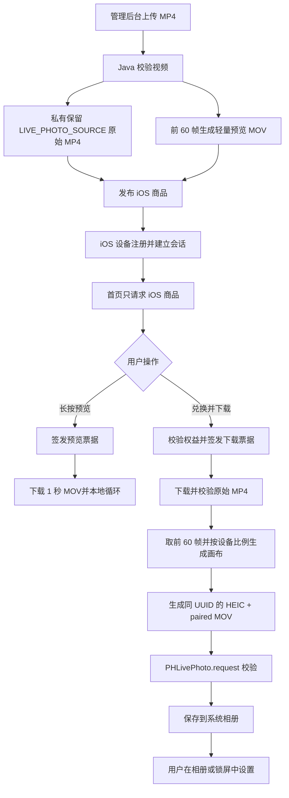

# API-024 iOS 动态壁纸端到端实现与发布手册

**状态：** iOS 客户端已切换原始 MP4 单次编码；Java API 等待按本文第 5 节改造和部署

**日期：** 2026-09-29

**OpenAPI 版本：** `2.13.0`

## 1. 最终结论

倾境 iOS 动态壁纸采用“后端生成免费预览，权益通过后交付原始 MP4，iOS 本地只编码一次”的方案。后端标准化 MOV 只用于长按预览，不再作为正式 Live Photo 的合成输入。

最终实现按 IntoLive 的实际行为处理：

1. 解码源视频，按显示顺序取前 `60` 个独立视频帧。
2. 不改变这 60 帧的内容、顺序和编号。
3. 将这 60 帧重新标记为 `60 fps`，得到精确 `1.000 秒`的视频。
4. 丢弃第 61 帧及其后的画面。
5. 不保留音频、字幕或源文件元数据。
6. Java 后端将标准化 MOV 只用于免费预览；正式下载仅向已授权设备交付原始 MP4。
7. iOS 客户端从原始 MP4 按显示顺序取前 60 帧，按当前设备屏幕比例生成画布。
8. iOS 客户端使用 40～100 Mbps 自适应码率只编码一次，再用 Apple 原生框架生成具有同一标识的 HEIC/MOV 配对，先校验再保存。

这不是“截取源视频前 1 秒”。对一段 `30 fps / 2 秒`素材，必须保留原来的前 60 帧，再把播放时间从约 2 秒压缩为 1 秒。动画设计依赖帧顺序时，任何抽帧、补帧或插帧都会改变效果。

本次还确认了两个与 Live Photo 文件无关、但会造成真机不可用的打包规则：

1. 给用户或测试设备安装时必须构建 `Release`。iOS 14 以后，Flutter `Debug` 包从桌面独立启动会白屏或被系统终止。
2. Release 构建必须显式传入 `API_BASE_URL=https://wallpaper.biguo66.top/api/v1`。省略后应用会使用保护地址 `https://api.invalid/api/v1`，页面可以打开但不会加载任何线上商品。

## 2. 已验证的 IntoLive 基准

本次使用同一段素材分别由 IntoLive 和倾境测试程序处理，并在 iPad 真机锁屏中验证。

| 项目 | 基准结果 |
| --- | --- |
| 输入 | H.264 MP4，1080×2338，30 fps，约 2.033 秒，61 个视频帧，含 AAC 音频 |
| IntoLive 输出 | HEVC/hvc1 MOV，60 fps，1.000 秒，60 个视频帧 |
| 音频 | IntoLive 输出包含音频，但倾境无音频版本同样通过，因此倾境必须移除音频 |
| 封面帧 | 输出时间 0.5 秒，对应第 31 帧（从 1 开始计数） |
| 真机结果 | 可保存为 Live Photo，锁屏动态效果可用 |

逐帧比对结果：

| 输出帧 | 对应输入帧 |
| --- | --- |
| 1 | 1 |
| 16 | 16 |
| 31 | 31 |
| 46 | 46 |
| 60 | 60 |

因此禁止使用以下处理：

- 截取输入时间轴的前 1 秒；
- 只取中间一段；
- 插帧、补帧、混帧或复制帧；
- 调整第 16～30 帧在帧序列中的位置；
- 用 `-t 1` 配合原始 30 fps 直接输出 30 帧。

## 3. 上传素材规则

Java 仍读取 `LIVE_PHOTO_SOURCE` 绑定的 MP4 文件。

必须满足：

- 只有一个有效视频轨；
- 视频编码为 H.264 或 HEVC；
- 解码后至少有 60 个可显示帧；
- 宽高均为正数且不超过现有安全上限；
- YUV 4:2:0 素材宽高必须为偶数；
- 文件大小继续使用现有限制。

推荐运营上传：

- `30 fps`；
- `2.0～2.1 秒`；
- 至少 `60` 个视频帧；
- 动画设计以帧编号为准，尤其保留第 `16～30` 帧的既定内容。

输入时长和声明帧率可以不同，但后端选择范围只由“解码后的前 60 个显示帧”决定。少于 60 帧时不得静默复制帧，必须拒绝生成。

## 4. Java 预览媒体处理规则

修改位置：

- `DynamicPhotoMediaProcessor.livePhoto`
- `DynamicPhotoMediaProcessor` 中 iOS 专用的视频生成与校验方法
- `LivePhotoPublisher` 的错误码映射和生成结果记录

### 4.1 预览视频标准化

Live Photo 发布构建仍生成用于详情长按的轻量预览 MOV。预览分支必须固定走转码，不再尝试 REMUX/PASSTHROUGH：

1. 按解码显示顺序读取视频帧。
2. 只保留帧索引 `0...59`。
3. 输出时间戳使用 `PTS = N / 60`。
4. 输出固定为：
   - 容器：QuickTime MOV；
   - 编码：HEVC Main；
   - codec tag：`hvc1`；
   - 像素格式：YUV 4:2:0；
   - 帧率：`60/1`；
   - 视频帧数：`60`；
   - 时长：`1.000 秒`；
   - video time base：建议 `1/600`；
   - 音频、字幕和数据轨：全部移除；
   - faststart：开启。
5. 后端标准化阶段保持上传视频的原始宽高，不裁切主体，也不写死 1080×1920、1080×1546 或 1344×1926。

iPhone/iPad 的最终画布比例由 iOS 客户端在正式下载后处理：主体使用 `aspectFit`，空白区域使用同一画面的模糊 `aspectFill` 背景。Java 发布阶段不负责设备画布适配，也不对正式下载源再做一次有损编码。

等价的 FFmpeg 处理逻辑示例：

```bash
ffmpeg -v error -xerror -y -nostdin \
  -i source.mp4 \
  -map 0:v:0 -an -sn -dn \
  -vf "select='lt(n,60)',setpts=N/(60*TB),format=yuv420p" \
  -frames:v 60 -r 60 \
  -c:v libx265 -preset medium -crf 12 \
  -tag:v hvc1 -video_track_timescale 600 \
  -map_metadata -1 -movflags +faststart \
  normalized.mov
```

命令只是实现参考。最终必须以第 7 节的逐帧验收为准，不能只检查 FFmpeg 是否返回成功。

### 4.2 封面帧

封面使用标准化视频的第 31 帧（零基索引 `30`，时间 `0.500 秒`）。

不得重新从原视频按 `-ss 0.5` 取帧，因为原视频的 0.5 秒不一定对应标准化结果的第 31 帧。

### 4.3 Apple 配对元数据

现有两组元数据轨可以继续使用：

- `com.apple.quicktime.live-photo-info`
- `com.apple.quicktime.still-image-time`
- `com.apple.quicktime.live-photo-still-image-transform`

HEIC MakerApple `17` 与 MOV `com.apple.quicktime.content.identifier` 仍需使用同一个 UUID。

这些 Apple 配对元数据不用于免费预览。它们由 iOS 客户端从原始 MP4 生成最终文件时写入：

1. 读取原始 MP4 的第一个视频轨，只取前 60 个显示帧；
2. 按当前设备画布完成 `aspectFit + 模糊背景`；
3. 使用 Apple ImageIO 重新生成带相同新 UUID 的 HEIC；
4. 使用 AVFoundation 将视频轨作为第一轨，并写入模板中的两个 metadata 轨；
5. 先通过 `PHLivePhoto.request` 校验，再以 `.photo + .pairedVideo` 保存。

不能继续把 Java/MP4Box 生成的文件直接写入相册作为最终成品。现有实现中 metadata 轨排在视频轨前，虽然相册能播放，锁屏仍可能拒绝动态效果。

## 5. Java 正式下载改造

### 5.1 接口契约

OpenAPI 升级为 `2.13.0`。预览接口保持不变：

- `POST /api/v1/device/wallpapers/{wallpaperId}/preview-tickets`
- `GET /api/v1/preview/live-photo/video`

正式下载票据仍通过以下接口签发：

- `POST /api/v1/device/wallpapers/{wallpaperId}/download-tickets`

请求体不变：

```json
{
  "deliveryPlatform": "IOS",
  "resourceType": "LIVE_PHOTO"
}
```

成功响应不再返回供最终合成使用的 `photo` 和 `video`，改为返回 `sourceVideo`：

```json
{
  "deliveryMode": "LIVE_PHOTO",
  "wallpaperId": "123",
  "ticket": "43位Base64URL字符串",
  "expiresAt": "2026-09-29T12:00:00Z",
  "resourceVersion": {
    "id": "456",
    "variantId": "789",
    "versionNo": 1,
    "platform": "IOS",
    "resourceType": "LIVE_PHOTO",
    "manifestSha256": "..."
  },
  "sourceVideo": {
    "url": "/api/v1/delivery/live-photo/source",
    "mimeType": "video/mp4",
    "sizeBytes": 12345678,
    "sha256": "64位小写十六进制"
  }
}
```

新增受保护的源文件读取接口：

- `GET /api/v1/delivery/live-photo/source`
- `Authorization: Bearer {download ticket}`
- `Accept: video/mp4`
- 成功返回 `200` + `Content-Type: video/mp4`
- 必须返回准确的 `Content-Length`、`Digest` 和 `Cache-Control: no-store`
- 不允许 `3xx` 跳转，不返回存储地址或可长期访问的 URL

### 5.2 Java 修改点

1. `DeliveryDtos.DownloadDescriptor` 增加 `DeliveryFile sourceVideo`。
2. `DownloadTicketService.createLivePhoto` 通过当前已发布的 `resource_version` 读取 `resource_binding.role=LIVE_PHOTO_SOURCE` 对应的原始资产。
3. 资产必须为 `validation_status=READY`、`deleted_at IS NULL`、`mime_type=video/mp4`，且存储对象的字节数和 SHA-256 与数据库一致。
4. `DownloadDescriptor.sourceVideo` 必须引用上述原始资产的大小和 SHA-256，不能引用 `live_photo_package.video_*` 标准化 MOV 字段。
5. `DeviceDownloadController` 新增 `/api/v1/delivery/live-photo/source`，并使用现有 `downloadTicketBearer` 读取。
6. `DownloadTicketService` 在签发票据时和延迟 HTTP 流真正开始时各校验一次设备、凭据、iOS 平台、商品发布状态、资源版本、文件元数据和权益。
7. 收费商品没有 `ACTIVE` 权益时返回 `403 ENTITLEMENT_REQUIRED`；票据过期、设备不匹配或资源状态变化时返回 `401 DOWNLOAD_TICKET_INVALID`。
8. 保持现有 90 秒 TTL、每设备限流和全局并发下载限制。原始存储对象不得设置为公开读。

### 5.3 预览与历史字段

`live_photo_package` 继续保存后端生成的 HEIC/MOV、SHA-256、尺寸、时长和处理信息，但标准化 MOV 只供 `/preview/live-photo/video` 使用。旧的 `/delivery/live-photo/image` 和 `/delivery/live-photo/video` 可在过渡期保留代码兼容，新版 iOS 不得再调用它们。

本次无需新增 Flyway 字段；原始 MP4 已通过 `LIVE_PHOTO_SOURCE` 绑定保留在资产表和私有存储中。

## 6. 错误码

当前使用以下错误码：

| HTTP | 错误码 | 场景 |
| --- | --- | --- |
| 422 | `DYNAMIC_SOURCE_FORMAT_INVALID` | 视频轨、编码、尺寸或像素格式不支持 |
| 422 | `IOS_LIVE_PHOTO_FRAME_COUNT_INVALID` | 解码后少于 60 个可显示帧 |
| 422 | `LIVE_PHOTO_PROCESSING_FAILED` | 转码、封面、元数据写入或生成后校验失败 |
| 403 | `ENTITLEMENT_REQUIRED` | 收费壁纸未兑换或当前设备无有效权益 |
| 401 | `DOWNLOAD_TICKET_INVALID` | 票据过期、设备/凭据不匹配、资源变化或非 iOS 访问 |
| 404 | `RESOURCE_NOT_AVAILABLE` | 没有可用的原始 MP4 绑定 |

`LivePhotoPublisher.errorCode` 必须保留 `IOS_LIVE_PHOTO_FRAME_COUNT_INVALID`，不能统一覆盖成 `LIVE_PHOTO_PROCESSING_FAILED`。

## 7. 后端自动验收

### 7.1 媒体属性

对生成的标准化视频必须同时验证：

- 只有一个视频轨；
- 没有音频、字幕轨；
- 视频编码为 `hevc`；
- codec tag 为 `hvc1`；
- 帧率精确为 `60/1`；
- 解码帧数精确为 `60`；
- 时长在 `0.998～1.002 秒`；
- 宽高等于输入视频显示宽高；
- HEIC 尺寸等于视频尺寸；
- HEIC 和 MOV 的 Content Identifier 一致；
- MOV 仍包含两组 Live Photo metadata 轨。

仅校验 `duration=1 秒` 和 `frameRate=60` 不够，必须实际解码计数为 60 帧。

### 7.2 逐帧一致性

测试夹具至少包含一段 `30 fps / 2.033 秒 / 61 帧`视频。

分别解码输入前 60 帧和输出 60 帧，在统一色彩空间与尺寸后逐帧比较。允许有 HEVC 有损编码误差，但必须满足：

- 输出第 N 帧只对应输入第 N 帧；
- 不能出现重复帧、跳帧或顺序变化；
- 至少显式断言第 `1、16、31、46、60` 帧的对应关系；
- 输出第 61 帧不存在。

### 7.3 接口回归

- 管理后台构建成功后状态为 `READY`；
- 未兑换预览接口只返回 60 帧 MOV，描述和网络响应中都不得出现原始 MP4 地址；
- 收费商品无权益时，正式票据返回 `403 ENTITLEMENT_REQUIRED`；
- 权益通过后，描述只包含 `sourceVideo=/api/v1/delivery/live-photo/source`、`video/mp4`、原文件大小和 SHA-256；
- 原始 MP4 端点拒绝预览票据、过期票据、其他设备票据和 Android/HarmonyOS 会话；
- 下载内容的字节数、SHA-256 和 MIME 与 `sourceVideo` 完全一致；
- iOS 以外的平台不能请求该资源；
- 已发布资源若已保留有效 `LIVE_PHOTO_SOURCE` 绑定，无需为正式下载重新转码；只有预览 MOV 不符合新规则时才需重新 build。

## 8. 标准发布与联调顺序

1. Java 实现 `sourceVideo` 描述、原始 MP4 受保护下载端点和 OpenAPI `2.13.0`。
2. Java 补齐无权益、票据过期、设备不匹配、资源变化和文件篡改的自动测试。
3. Java 在测试环境部署，用真实已兑换设备验证描述、MIME、大小和 SHA-256。
4. iOS 使用原始 MP4 的前 60 个显示帧生成 Live Photo，并在真机验证画质、相册播放和锁屏动态效果。
5. 验收通过后再单独确认并部署生产 Java API，随后打包 iOS 正式版。

验收通过的最终标准不是“相册里能动”，而是 iOS 锁屏编辑页不再显示“动态效果不可用”，并且设置后按压可播放完整动画。

## 9. 前后端职责边界

### 9.1 Java API 必须负责

1. 接收运营上传的 MP4，并读取 `LIVE_PHOTO_SOURCE` 资源。
2. 校验输入视频轨、编码、尺寸、像素格式和可解码帧数。
3. 用前 60 帧生成无权益用户可见的轻量预览 MOV，但预览描述和端点均不得读取原始 MP4。
4. 对免费商品或已有有效权益的收费商品签发正式下载票据，并返回 `sourceVideo`。
5. 在签发票据和流式下载开始时都校验设备、凭据、iOS 平台、权益、发布状态、存储键、大小和 SHA-256。
6. 使用私有存储和短时 Bearer 票据交付原始 MP4，不暴露存储路径、不签发公开 URL、不允许重定向。
7. 只向 iOS 安装身份下发 iOS 商品，并保留已有限流、并发保护和审计日志。

### 9.2 iOS 客户端必须负责

1. 使用安装级 P-256 身份完成注册、challenge、会话和敏感请求签名。
2. 未兑换预览只下载 1 秒标准化 MOV；长按时播放，持续按住时本地循环，松开时恢复封面。
3. 正式下载前校验服务端描述中的平台、资源类型、路径、MIME、大小和 SHA-256。
4. 下载原始 MP4，只取前 60 个显示帧，丢弃后续帧、音频、字幕和输入元数据。
5. 按当前 iPhone/iPad 原生屏幕比例生成最终画布，保持主体原始分辨率，用 40～100 Mbps 自适应码率只编码一次。
6. 使用 Apple 原生框架生成 HEIC 与 paired MOV，不把服务器文件直接写入相册。
7. 调用 `PHLivePhoto.request` 验证配对文件，验证成功后才以 `.photo + .pairedVideo` 保存。
8. 无论成功、失败或取消，都删除原始 MP4 临时文件和中间产物；成功后只记录相册 `localIdentifier`。

### 9.3 画质与安全边界

正式下载使用原始 MP4 是为了避免“Java HEVC 一次 + iOS HEVC 一次”的双重有损编码。源文件本身的清晰度仍是上限；客户端的高码率只能避免进一步明显损失，不能恢复源文件已丢失的细节。

未兑换用户只能获得标准化预览 MOV。原始 MP4 只经过正式下载票据交付，且客户端在本地生成完成后立即删除临时文件。已获权用户仍可能通过受控设备分析自己已下载的内容，该风险无法由客户端完全消除。

## 10. 完整业务流程



### 10.1 首次进入首页

1. App 读取编译期 `API_BASE_URL`。
2. iOS 插件生成或读取 Secure Enclave P-256 安装密钥。
3. 无服务端凭据时调用 `POST /api/v1/device/registrations`。
4. 调用 `POST /api/v1/device/session-challenges` 获取 challenge。
5. 使用 `ECDSA_P256_SHA256` 签名 challenge，并调用 `POST /api/v1/device/sessions`。
6. 使用 Bearer 会话请求分类和商品目录。
7. 服务端根据会话平台与 App 安装范围返回 iOS 商品。

如果首页 UI 正常但所有内容为空，先检查构建是否写入真实 `API_BASE_URL`，再检查设备注册和 Bundle ID 白名单。不要先修改首页状态管理。

### 10.2 详情长按预览

1. App 请求 `POST /api/v1/device/wallpapers/{wallpaperId}/preview-tickets`。
2. 请求体为 `deliveryPlatform=IOS`、`resourceType=LIVE_PHOTO`。
3. 服务端返回 `deliveryMode=LIVE_PHOTO_PREVIEW`、短期票据和 MOV 的大小、SHA-256、MIME。
4. App 使用预览票据读取 `GET /api/v1/preview/live-photo/video`。
5. App 禁止重定向，并校验 HTTP 200、`video/quicktime`、文件大小与 SHA-256。
6. 资源加载期间显示“资源加载中，请稍后”；加载成功后显示“长按查看动态效果”。
7. 用户持续按住时本地循环，松手立即停止并恢复封面。

预览不会创建权益、兑换记录或正式下载记录。

### 10.3 兑换与正式下载

1. 免费商品直接进入下载；收费商品先完成兑换并取得权益。
2. App 使用设备会话和敏感请求签名申请正式下载票据。
3. 服务端校验 iOS 安装身份、当前凭据、商品状态和权益，返回 `deliveryMode=LIVE_PHOTO` 及 `sourceVideo` 描述。
4. App 严格校验 `resourceVersion.platform=IOS`、`resourceType=LIVE_PHOTO`、固定相对路径和 `video/mp4`。
5. App 用正式票据下载 `/api/v1/delivery/live-photo/source`，禁止重定向，并校验 HTTP 200、MIME、字节数和 SHA-256。
6. App 取原始 MP4 的前 60 个显示帧，以 60 fps 生成精确 1 秒的设备比例画布，不使用音频和后续帧。
7. App 在临时目录生成最终 HEIC 和 paired MOV，通过 `PHLivePhoto.request` 后保存。
8. `defer` 清理原始 MP4、画布 MOV、HEIC 和 paired MOV 临时文件，UI 显示“已保存到相册，请设置”。

## 11. iOS 安装身份与请求签名

### 11.1 固定身份参数

| 参数 | 当前值 |
| --- | --- |
| 正式 Bundle ID | `com.qingjing.bizhi` |
| 测试 Bundle ID | `com.qingjing.livephotolab` |
| 私钥 | Secure Enclave P-256，安装级、不可导出 |
| 公钥上传格式 | X9.63 65 字节公钥包装为 X.509 SPKI PEM |
| 指纹 | SPKI DER 的 SHA-256，小写十六进制 |
| challenge 算法 | `ECDSA_P256_SHA256` |
| 签名格式 | X9.62 ECDSA ASN.1 DER |
| 传输编码 | Base64URL，无 `=` 填充 |
| 本地凭据 | Keychain，`ThisDeviceOnly` |

Java 白名单与 iOS 插件必须同时包含上述两个 Bundle ID。新增 Bundle ID 时必须同步修改两端，不能只改 Xcode。

### 11.2 会话签名原文

```text
QJ-DEVICE-SESSION-V1
{credentialKeyId}
{challengeId}
{nonce}
{clientTimestamp}
```

### 11.3 敏感请求签名原文

```text
QJ-SIGNED-REQUEST-V1
{HTTP_METHOD}
{/api/v1开头且不含查询参数的路径}
{timestamp}
{nonce}
{SHA-256请求体小写十六进制}
```

JSON 请求体必须先确定最终字节，再计算 body hash 和发送；不能签名后重新编码 JSON。

## 12. iOS 最终 Live Photo 生成细节

实现位置：

- `packages/wallpaper-ios/ios/Classes/NativeLivePhotoComposer.swift`
- `packages/wallpaper-ios/ios/Classes/WallpaperIosPlugin.swift`
- `packages/wallpaper-ios/ios/Resources/wallpaper-metadata-template.mov`
- `packages/wallpaper-ios/ios/wallpaper_ios.podspec`

### 12.1 设备画布

客户端读取 `UIScreen.main.nativeBounds`，统一使用竖屏短边和长边计算设备比例。最终画布以“主体不缩小”为原则：

```text
设备比例 r = 原生短边 / 原生长边

如果 源宽 / 源高 < r：
    目标高度 = 源高
    目标宽度 = 向上取偶数(源高 × r)

否则：
    目标宽度 = 源宽
    目标高度 = 向上取偶数(源宽 / r)

只有目标任一边超过 4096 时才等比缩小
```

例如本次 iPad 原生像素为 `1668×2388`，原始 MP4 为 `1080×2338`，最终高质量画布为约 `1634×2338`。主体保持原始 `1080×2338` 像素，只扩展左右模糊背景，不再缩小到 `714×1546`。后端交付上传视频的原始宽高，不写死分辨率。

每帧合成规则：

1. 背景使用同一帧 `aspectFill` 铺满画布。
2. 背景应用高斯模糊，当前半径为 `36`。
3. 前景使用 `aspectFit` 完整居中，不裁切主体。
4. 前景覆盖在模糊背景之上。

该方案同时解决“保持原图比例”和“不同屏幕比例不出现纯色留白”。

### 12.2 视频输出

客户端要求原始 MP4 至少可解码 60 个显示帧。它只取帧索引 `0...59`，忽略第 61 帧及后续帧，并输出：

| 项目 | 值 |
| --- | --- |
| 编码 | HEVC Main |
| 容器 | QuickTime MOV |
| 帧率 | 60 fps |
| 帧数 | 60 |
| 时长 | 1.000 秒 |
| 平均码率 | 按像素数自适应，`像素数 × 60 × 0.30`，限制在 40～100 Mbps |
| 最大关键帧间隔 | 60 |
| 音频 | 无 |
| 每帧时间戳 | `N/60` |

输入可以超过 60 帧，也可以带音频；客户端的 reader 只建立视频轨输出，完成 60 帧后主动停止读取。少于 60 帧时返回 Live Photo 生成失败，不复制帧补足。

### 12.3 HEIC 与 paired MOV

1. 为每次生成创建一个新的 UUID。
2. 从最终画布视频的 `0.5 秒`取封面，即零基第 30 帧、从 1 开始的第 31 帧。
3. HEIC 使用最高质量写出，并把 UUID 写入 MakerApple 字典的 `17`。
4. paired MOV 第一轨必须是视频轨。
5. 从内置模板复制两个 Apple metadata 轨。
6. MOV 的 `com.apple.quicktime.content.identifier` 写入同一个 UUID。
7. 使用 `PHLivePhoto.request` 验证 `[HEIC, MOV]` 能组成 Live Photo。
8. 使用 `PHAssetCreationRequest` 分别添加 `.photo` 和 `.pairedVideo`。

`wallpaper-metadata-template.mov` 必须随 `wallpaper_ios_assets.bundle` 打入 App。缺失时客户端应返回 `LIVE_PHOTO_INVALID`，不能退化成普通照片或普通视频。

## 13. 正式构建、安装与上架

### 13.1 测试设备安装包

在 `apps/mobile` 执行：

```bash
DEVELOPER_DIR=/Applications/Xcode-26.0.1.app/Contents/Developer \
  flutter build ios --release \
  --dart-define=API_BASE_URL=https://wallpaper.biguo66.top/api/v1
```

构建后必须校验：

```bash
codesign --verify --deep --strict --verbose=2 \
  build/ios/iphoneos/Runner.app

/usr/libexec/PlistBuddy -c 'Print :CFBundleIdentifier' \
  build/ios/iphoneos/Runner.app/Info.plist

rg -a -m 1 'https://wallpaper\.biguo66\.top/api/v1' \
  build/ios/iphoneos/Runner.app/Frameworks/App.framework/App
```

三项必须分别确认：签名有效、Bundle ID 正确、AOT 二进制确实包含线上 API 地址。

安装和启动使用实际连接设备标识：

```bash
xcrun devicectl device install app \
  --device {deviceId} build/ios/iphoneos/Runner.app

xcrun devicectl device process launch \
  --device {deviceId} --terminate-existing com.qingjing.bizhi
```

设备安装使用的是“Release 配置 + 开发描述文件”，可以从桌面独立启动，但它不是 App Store 上传包。

### 13.2 App Store 上架包

上架时仍必须带同一个线上 API 参数：

```bash
flutter build ipa --release \
  --dart-define=API_BASE_URL=https://wallpaper.biguo66.top/api/v1
```

随后通过 Xcode Organizer 或受支持的上传工具提交 Archive/IPA，并检查：

- Bundle ID 为 `com.qingjing.bizhi`；
- Version 与 Build 号符合 App Store Connect 当前版本；
- 使用 App Store 分发签名和描述文件；
- 包含 `wallpaper_ios_assets.bundle/wallpaper-metadata-template.mov`；
- 上传工具返回成功并在 App Store Connect 中完成处理。

“Release 构建成功”不等于“App Store 已提交”。

### 13.3 本机 Skill

iOS 固定打包流程已写入：

```text
/Users/kele/.codex/skills/qingjing-ios-package/SKILL.md
```

以后“打包 iOS”默认使用 Release 和线上 API；“打包”默认还包含签名校验、覆盖安装和启动检查。

## 14. 本次实际问题与根因

### 14.1 相册能播放，锁屏提示“动态效果不可用”

根因不是单一的“缺少 UUID”。已验证的影响因素包括：

- 只按时间截取 1 秒，导致原动画只有前 30 帧；
- 服务器生成的 MOV 轨道顺序不符合最终真机兼容结果；
- 视频画布比例与当前设备差异过大；
- 把服务端 HEIC/MOV 直接保存，缺少 Apple 原生重新封装与本机校验。

最终通过组合方案解决：前 60 帧重定时、设备比例画布、视频轨优先、同 UUID 元数据、`PHLivePhoto.request` 校验、`.photo + .pairedVideo` 保存。

### 14.2 信任后打开仍是白屏

设备日志为：

```text
Cannot create a FlutterEngine instance in debug mode without Flutter tooling or Xcode.
```

根因是安装了 Flutter Debug 包。Debug 包只能由 `flutter run`、Xcode 或 Flutter IDE 调试器启动。解决方法是安装 Release 包，业务代码无需修改。

### 14.3 Release 包打开但没有商品

根因是构建时漏传 `API_BASE_URL`。工程有意把默认值设为：

```text
https://api.invalid/api/v1
```

这是防止错误构建误连生产的保护措施。解决方法是重新构建并显式传入线上地址，同时用 `rg -a` 检查产物内是否包含真实地址。

### 14.4 安装后仍运行旧行为

依次确认：

1. 当前打开的应用 Bundle ID 是否为 `com.qingjing.bizhi`；测试 App `com.qingjing.livephotolab` 可以同时存在。
2. 安装命令是否使用了刚生成的 `build/ios/iphoneos/Runner.app`。
3. 安装后是否用正式 Bundle ID 执行 `--terminate-existing` 并重新启动。
4. 后端是否已部署 OpenAPI `2.13.0` 的 `sourceVideo` 描述和原始 MP4 端点。

## 15. 发布前验收清单

### 15.1 Java API

- [ ] OpenAPI 版本为 `2.13.0`。
- [ ] 正式和测试 Bundle ID 均已放行。
- [ ] 输入至少能解码 60 个显示帧。
- [ ] `live_photo_package.status=READY`，预览 MOV 为 60 帧、60 fps、1.000 秒。
- [ ] 发布版本仍绑定 `LIVE_PHOTO_SOURCE`，资产为 READY、未删除的 `video/mp4`。
- [ ] 正式描述返回 `sourceVideo`，不再让新 iOS 客户端使用 `photo/video` 合成。
- [ ] `sourceVideo` 的大小、SHA-256、MIME 和存储键与原始 MP4 一致。
- [ ] 预览票据不能读取正式下载接口，正式票据不能读取预览接口。
- [ ] 收费商品无权益时无法获得原始 MP4。
- [ ] 原始 MP4 响应不重定向，且包含 `Cache-Control: no-store`。

### 15.2 iOS 客户端

- [ ] Secure Enclave 注册、challenge 和会话成功。
- [ ] 首页只显示 iOS 商品。
- [ ] 详情页加载时提示正确，长按可循环预览，松开恢复封面。
- [ ] 正式描述只接受固定 `sourceVideo` 路径、`video/mp4`、iOS 平台和 LIVE_PHOTO 类型。
- [ ] 原始 MP4 下载时校验 HTTP 状态、MIME、大小和 SHA-256。
- [ ] 输入超过 60 帧时只使用前 60 帧，少于 60 帧时拒绝生成。
- [ ] 最终画布使用当前设备比例，前景完整、背景模糊填充。
- [ ] 主体不因画布适配而缩小，HEVC 码率按像素数自适应到 40～100 Mbps。
- [ ] HEIC 与 MOV 使用同一个新 UUID。
- [ ] MOV 第一轨为视频轨，并包含两个 metadata 轨。
- [ ] `PHLivePhoto.request` 验证成功后才写相册。
- [ ] 完成、失败或取消后都删除原始 MP4 和所有中间文件。
- [ ] 相册中显示为 Live Photo。
- [ ] 锁屏编辑页不显示“动态效果不可用”。
- [ ] 锁屏按压可以播放完整动画。

### 15.3 构建与安装

- [ ] 构建模式为 Release。
- [ ] 显式传入线上 `API_BASE_URL`。
- [ ] `codesign --verify --deep --strict` 通过。
- [ ] Bundle ID 为 `com.qingjing.bizhi`。
- [ ] 产物二进制包含正确线上地址。
- [ ] 元数据模板已打入资源 bundle。
- [ ] 覆盖安装成功，并能从桌面独立启动。
- [ ] 首页分类和商品能够加载。
- [ ] 真机完成一次预览、兑换、下载、保存和锁屏设置全流程。

## 16. 排障顺序

| 现象 | 第一检查项 | 常见根因 |
| --- | --- | --- |
| 点击同意后接口报错 | 设备注册与 Bundle ID 白名单 | 正式/测试 Bundle ID 未同步放行 |
| 页面能开但没有内容 | 产物内 `API_BASE_URL` | Release 构建漏传 dart-define |
| 信任后启动白屏 | 设备控制台 | 误装 Flutter Debug 包 |
| 长按没有动态效果 | 预览票据与 MOV 下载校验 | 后端未部署或资源未重新构建 |
| 兑换后立即下载失败 | `sourceVideo` 与 OpenAPI 版本 | Java 仍返回旧 `photo/video` 描述 |
| 收费商品未兑换却能下载 | 权益校验与原始 MP4 端点 | 原始存储公开或读取端点未重验权益 |
| 相册里是静态图 | `.pairedVideo` 保存流程 | HEIC/MOV 未按 Live Photo 资源写入 |
| 相册会动但锁屏不可用 | 60 帧、画布、轨道和元数据 | 直接保存服务端文件或配对不兼容 |
| 图片被裁切 | 客户端画布合成 | 前景误用 aspectFill |
| 图片两边纯色留白 | 客户端画布合成 | 缺少同帧模糊 aspectFill 背景 |
| 下载校验失败 | `sourceVideo` 与原始 MP4 的大小/SHA-256 | 描述误用标准化 MOV 元数据、缓存或存储记录不一致 |
| 新代码安装后仍是旧效果 | Bundle ID、安装路径、旧进程 | 同机存在测试包或没有终止旧进程 |

排障时先确认“构建配置和接口地址”，再检查“身份与票据”，最后检查“媒体文件”。这样可以避免把打包问题误判成视频算法问题。

## 17. 代码与资源索引

| 作用 | 文件 |
| --- | --- |
| Flutter 构建期 API 配置 | `apps/mobile/lib/config/app_config.dart` |
| iOS 安装身份、下载校验、相册保存 | `packages/wallpaper-ios/ios/Classes/WallpaperIosPlugin.swift` |
| iOS 设备画布和原生 Live Photo 合成 | `packages/wallpaper-ios/ios/Classes/NativeLivePhotoComposer.swift` |
| Apple metadata 模板 | `packages/wallpaper-ios/ios/Resources/wallpaper-metadata-template.mov` |
| iOS 插件资源打包 | `packages/wallpaper-ios/ios/wallpaper_ios.podspec` |
| Java 动态照片转码 | `services/api-server/src/main/java/com/qingjing/wallpaper/delivery/infrastructure/DynamicPhotoMediaProcessor.java` |
| Java Live Photo 发布与状态记录 | `services/api-server/src/main/java/com/qingjing/wallpaper/delivery/LivePhotoPublisher.java` |
| Java 正式下载票据与权益校验 | `services/api-server/src/main/java/com/qingjing/wallpaper/delivery/DownloadTicketService.java` |
| Java 原始 MP4 流式响应 | `services/api-server/src/main/java/com/qingjing/wallpaper/delivery/DeviceDownloadController.java` |
| Java 下载描述 DTO | `services/api-server/src/main/java/com/qingjing/wallpaper/delivery/DeliveryDtos.java` |
| iOS ECDSA 凭据验证 | `services/api-server/src/main/java/com/qingjing/wallpaper/device/IosCredentialProof.java` |
| OpenAPI 契约 | `contracts/openapi/openapi.yaml` |
| iOS 固定打包流程 | `/Users/kele/.codex/skills/qingjing-ios-package/SKILL.md` |
