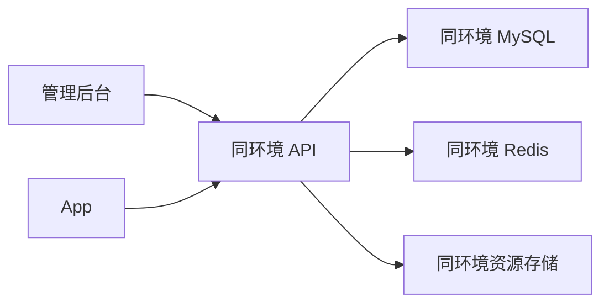

# OPS-005 倾境壁纸运维总则

**状态：** 已确认，唯一生效的运维规则入口

**版本：** 1.1

**日期：** 2026-09-17

**适用范围：** App、Java API、管理后台、MySQL、Redis、资源存储、构建、部署、联调、数据操作、回滚和验收

## 1. 文档治理

### 1.1 唯一规则入口

本文件是本项目唯一生效的全局运维规范。执行启动、联调、构建、部署、迁移、数据清理、发布、回滚或验收前，以本文件为规则依据。

以后出现新的运维问题时：

1. 在任务看板或验收记录中保存问题事实、原因和验证证据。
2. 如果结论会影响以后操作，直接修改本文件，提升版本并补充第 13 节变更记录。
3. 删除被新规则替代的旧表述，不能让两套口径并存。
4. 不再为单个问题新增一份 OPS 规则文档。
5. 已经被本总则完整吸收且没有独立用途的文档直接删除，历史通过 Git 查询。

### 1.2 执行时需要阅读哪些文档

部署前不需要遍历整个文档目录。先读本总则；只有任务命中下表时，再读一份对应技术手册：

| 任务 | 必读 | 按需技术手册 |
|---|---|---|
| 日常本地 API 启停 | 本总则 | [OPS-001 本地 API 开发环境](OPS-001-本地API开发环境.md) |
| Android 真机连接本地 API | 本总则 | [OPS-002 Android 真机连接本地 API](OPS-002-Android真机连接本地API.md) |
| Android 内部候选版安装 | 本总则 | [OPS-003 Android 内部候选版安装说明](OPS-003-Android内部候选版安装说明.md) |
| Android 双包构建和命名 | 本总则 | [OPS-004 Android 双包打包与命名规范](OPS-004-Android双包打包与命名规范.md) |
| LOCAL_DEVICE API 部署、数据操作、服务器发布、迁移或回滚 | 本总则 | 无 |

OPS-001 至 OPS-004 只说明具体命令和操作步骤，不得另行定义环境、数据、发布或安全规则。若与本总则冲突，以本总则为准并立即修正文档。

## 2. 固定环境和数据边界

### 2.1 环境矩阵

| 环境 ID | 用途 | API | MySQL | Redis | 资源目录/存储 | 管理后台 | App |
|---|---|---|---|---|---|---|---|
| `LOCAL_DEV` | 日常 API 和后台开发 | `http://127.0.0.1:8080` | `127.0.0.1:3307/wallpaper_app` | `127.0.0.1:6380` | `.runtime/storage` | 5176 默认代理 8080 | `localDebug` / `com.qingjing.bizhi.local` |
| `LOCAL_DEVICE` | Android 真机、Lab 和虚拟数据联调 | 电脑 `http://127.0.0.1:8083`；手机 `https://127.0.0.1:8443` | `127.0.0.1:3311/wallpaper_android` | `127.0.0.1:6391` | `.runtime/android-api12/storage` | 5176 必须显式代理 8083 | `internal` / `com.qingjing.bizhi.internal`；`lab` / `com.qingjing.bizhi.lab` |
| `ONLINE_MAIN` | 唯一线上服务器环境 | 独立 HTTPS 域名，待部署确定 | 同一服务器的唯一线上 schema | 同一服务器的唯一线上 Redis | 同一服务器持久化目录 | 同一服务器后台 | 验证阶段 `staging`；生产阶段 `prod` / `com.qingjing.bizhi` |

端口、schema、路径或环境 ID 发生调整时，必须在同一变更中同步修改本表、脚本、构建配置和验收检查。

服务器前期只有一套 `ONLINE_MAIN` 数据库。上线前是 `VALIDATION` 阶段，上线后原地切换为 `PRODUCTION`，不建立所谓“线上测试库”。开发电脑仍保留 `LOCAL_DEV` 与 `LOCAL_DEVICE` 两套互相隔离的本地数据库。

### 2.2 一条链路只能属于一个环境

管理后台、App、API、MySQL、Redis 和资源存储必须属于同一个环境 ID：



禁止混接：

- 5176 代理 8083，却把新增内容当成 3307 的数据。
- API 使用一套 MySQL，同时读取另一环境的 Redis 或资源目录。
- `local`、`internal`、`lab` 连接 `ONLINE_MAIN`。
- `staging` 在 `PRODUCTION` 阶段执行写入型验收。
- `prod` 在 `VALIDATION` 阶段发布。
- App 或管理后台直接访问 MySQL、Redis 或资源目录。

### 2.3 软件同步，数据隔离

`LOCAL_DEVICE` 与 `ONLINE_MAIN` 保持软件基线一致：

- Git 提交与不可变 Java 制品；
- Flyway 迁移历史和最终 schema；
- OpenAPI 版本、路由和 DTO；
- App 使用的接口、资源包、签名和校验协议；
- 环境变量名称和部署结构。

以下内容必须隔离，不得自动同步：

- MySQL 业务数据和自增编号；
- Redis 缓存、会话、票据和幂等状态；
- 实际资源文件和存储路径；
- 管理员账号、设备身份、权益、兑换码和审计记录；
- 数据库密码、主密钥、签名私钥、TLS 私钥和 APK 签名材料。

正式内容进入 `ONLINE_MAIN` 时，使用管理 API 或受控导入并核对资源校验值。不得复制整个本地数据库、Redis 或资源目录覆盖线上。

## 3. App 和管理后台绑定

### 3.1 App

| App flavor | 允许连接 | 禁止连接 |
|---|---|---|
| `local` | `LOCAL_DEV` | `LOCAL_DEVICE`、`ONLINE_MAIN` |
| `internal` | `LOCAL_DEVICE` | `LOCAL_DEV`、`ONLINE_MAIN` |
| `lab` | `LOCAL_DEVICE` | `LOCAL_DEV`、`ONLINE_MAIN` |
| `staging`（待新增） | `ONLINE_MAIN / VALIDATION` | 两套本地环境、生产阶段 |
| `prod` | `ONLINE_MAIN / PRODUCTION` | 两套本地环境、验证阶段 |

App 内不提供用户可编辑的 API 地址。构建时固定 API 地址、环境 ID 和允许阶段；运行时核对 API 返回值，不匹配时拒绝继续。

`internal` 桌面名称为“倾境动态壁纸·本地测试”，`lab` 为“4D壁纸·本地测试”。无后缀的“倾境动态壁纸”只属于 `prod`。

### 3.2 管理后台

- 未设置 `VITE_API_PROXY_TARGET` 时，5176 属于 `LOCAL_DEV` 并代理 8080。
- 操作 `LOCAL_DEVICE` 前必须设置 `VITE_API_PROXY_TARGET=http://127.0.0.1:8083` 并重启 Vite。
- 切换 API 后旧浏览器会话作废，必须重新登录。
- 浏览器地址 5176 不能证明数据落点；验收记录必须写明 `5176 -> 8080` 或 `5176 -> 8083`。
- `ONLINE_MAIN` 使用服务器固定后台地址，不通过临时修改本地 Vite 代理操作线上。

## 4. “启动本地 App 联调环境”的固定含义

用户说：

> 启动本地 App 联调环境（虚拟数据）。

固定执行以下操作：

1. 确保 `LOCAL_DEVICE` 的 MySQL 3311、Redis 6391 和资源目录可用。
2. 先运行 `python3 scripts/local-device-api.py status`；若制品不一致，按第 5 节完成提交、构建和部署。
3. 启动或恢复 API 8083。
4. 启动或恢复 8443 HTTPS 到 8083 的入口；设备已连接时核对 ADB reverse。
5. 启动或恢复管理后台 5176，并确认代理到 8083。
6. 只读核对真实链路、运行制品和健康状态。
7. 保留现有数据，不初始化、不造数、不清理。
8. 不构建、安装或启动 App；除非用户另外明确要求。
9. 不启动或连接 `LOCAL_DEV` 的 8080/3307。

需要完整描述时使用：

> 启动本地 App 联调环境（虚拟数据）。启动 API、8443 HTTPS 接入和管理后台，不启动 App；使用 `LOCAL_DEVICE`：管理后台 5176 → API 8083 → MySQL 3311/`wallpaper_android` → Redis 6391，资源目录 `.runtime/android-api12/storage`。不要启动或连接 8080/3307；保留现有数据。启动后只读核对并回报实际链路和健康状态。

“启动管理后台”只授权启动后台页面；“启动本地”或“连测试库”没有明确环境，先只读识别现状，不能据此选择数据库或清理数据。

启动完成后必须按第 10 节模板回报，不能只说“已启动”。

## 5. API 制品一致性和部署门禁

### 5.1 触发重新部署的变更

以下变更必须重新构建并部署 API：

- Java 业务代码、路由、DTO 或安全规则；
- Flyway 迁移；
- OpenAPI 路由、结构或版本；
- API `application*.yml` 或依赖。

只修改 App、管理后台或文档时，不需要重建 API，但仍需用状态命令确认当前目标环境。

API 范围有未提交改动时，LOCAL_DEVICE 部署必须拒绝。先完成实现、相关测试、OpenAPI/迁移/文档和 Git 提交，再产生可追溯制品。

### 5.2 六项身份

API 只有同时核对以下信息，才能宣称已部署：

1. Git 提交；
2. API 源码范围 SHA-256；
3. OpenAPI 版本；
4. 运行 Jar SHA-256；
5. Flyway 版本；
6. 环境 ID 与部署阶段。

`UP`、端口可访问、PID、文件名或文件时间都不能证明运行的是当前 API。运行事实以正在运行的 API `/actuator/info` 回读结果为准。

### 5.3 LOCAL_DEVICE 唯一入口

只读检查：

```bash
python3 scripts/local-device-api.py status
```

部署当前已提交的 API：

```bash
python3 scripts/local-device-api.py deploy
```

`deploy` 固定使用 8083、3311/`wallpaper_android`、6391、`.runtime/android-api12/storage` 和本地 App scope。它执行 Maven `verify`，生成不可变 Jar，原子换包，重启并从真实 API 回读元数据。它不会初始化、造数、清理或重置业务数据；Flyway 只执行制品携带且尚未应用的迁移。

`status` 发现 API 范围未提交变更时返回 `UNCOMMITTED_API_CHANGES`；发现旧包、错包或元数据不一致时返回 `STALE_OR_WRONG_API`。任何非零结果都表示环境未就绪。

### 5.4 强制闭环

```text
实现和测试
→ 更新 OpenAPI、迁移和本总则/验收记录
→ Git 提交
→ 重新构建不可变 Jar
→ 原子换包并重启
→ 回读 /actuator/info 和 readiness
→ 核对 Git、源码哈希、OpenAPI、Jar、Flyway、环境
→ 再开始 App 或管理后台验收
→ 更新任务看板和验收记录
```

禁止直接运行 `target/*.jar`、复用手工命名的 `current` 或 `preview` Jar、只看 readiness 判断版本，或为了换包清空 MySQL、Redis、资源目录和 App 数据。

## 6. 数据操作

### 6.1 请求必须明确

清理、重置、批量导入或数据库修复请求必须包含：

1. 环境 ID；
2. API、MySQL 端口和 schema；
3. 删除或修改对象；
4. 保留对象；
5. 是否删除资源文件。

例如：

> 清空 `LOCAL_DEVICE（API 8083 / MySQL 3311 / wallpaper_android / .runtime/android-api12/storage）` 的分类、壁纸及业务资源，保留管理员、设置教程、设备和教程视频。

没有“清空”“重置”等明确指令时，启动操作不得写入或删除数据。“清空本地数据”目标不明确，必须先只读列出候选环境和数据量。

### 6.2 Plan、Apply、Verify、Record

所有数据操作使用同一流程：

1. **Plan：** 输出环境、数据库、Redis、资源目录、计划修改及保留的表和文件数量，不写数据。
2. **Apply：** 只执行 Plan 中的环境和范围；目标变化后重新 Plan。
3. **Verify：** 从 MySQL、资源目录、Redis、公开 API 和管理 API 读回。
4. **Record：** 记录时间、环境、修改/保留数量和结果，不记录密码或 Token。

删除资源记录时同步处理对应文件。保留教程时同时保留教程表、资源记录和教程视频。MySQL 是业务事实唯一来源；Redis 只保存缓存、限流、会话、短时票据和幂等协调状态。

`LOCAL_DEV` 和 `LOCAL_DEVICE` 可以在用户明确授权范围内处理。`ONLINE_MAIN / VALIDATION` 先生成一致性备份；`ONLINE_MAIN / PRODUCTION` 的发布、迁移、删除和修复必须取得明确的生产操作确认。

## 7. ONLINE_MAIN 发布和阶段切换

标准发布顺序：

1. 在 `LOCAL_DEVICE` 使用目标 Git 提交、不可变 Jar、Flyway 和 OpenAPI 完成验收。
2. 把同一已验收制品部署到 `ONLINE_MAIN / VALIDATION`，不能在服务器重新修改源码或构建另一份 Jar。
3. 线上 API 对唯一线上数据库执行对应 Flyway 迁移。
4. 正式内容通过管理 API 或受控导入进入线上并核对资源校验值。
5. 使用 `staging` App 做短验收。
6. 备份 MySQL 与资源目录，删除有明确标记的验收数据。
7. 将阶段原地切换为 `PRODUCTION`，轮换验证期临时凭据，再发布 `prod`。

线上 MySQL 和资源目录必须使用持久化磁盘；MySQL 与 Redis 不开放公网端口。每日同时备份数据库和资源目录，并把备份复制到服务器外；发布、迁移和批量清理前额外生成一致性备份。

线上发布后先回读 `/actuator/info` 和 readiness，再允许 App 验收或流量进入。Flyway 已执行后不能直接换回旧 Jar；先确认旧制品与当前 schema 兼容，否则使用向前修复。

### 7.1 蓝绿发布基线

`ONLINE_MAIN` 复用现有 Woodpecker 平台，但使用 `Jerry1254/wallpapersapp` 自己的仓库配置和仓库级秘密。不与其他项目共享部署目录、服务名、数据库、Redis、资源目录或服务器密钥。

- 蓝槽：API `8080`，管理端口 `8081`。
- 绿槽：API `8082`，管理端口 `8083`。
- Nginx 只代理当前活动槽；候选槽 readiness、公开接口和六项制品身份全部通过后才切换流量。
- 活动槽不运行定时任务，非活动槽作为 worker 单实例运行定时任务，避免重复执行。
- MySQL、Redis 和资源目录继续使用 `/opt/qingjing/shared` 的现有配置与持久化数据，发布包不携带业务数据和秘密。
- 数据库地址仅由服务器环境文件注入。当前使用服务器本机 MySQL；未来改为云 MySQL 时只调整受限配置，不改业务代码和发布包结构。

### 7.2 发布包与数据库门禁

每个不可发布包固定包含 Java Jar、管理后台静态资源、全部 Flyway 迁移、`manifest.json` 和受控运行身份。服务器按发布号保存到 `/opt/qingjing/releases` 并通过原子软链接切换，不覆盖旧制品。

API 发布前检查待执行迁移；蓝绿模式只自动允许兼容性向前迁移。发现 `DROP`、`TRUNCATE`、重命名、字段类型直接修改或数据删除时必须拒绝自动发布。候选 API 完成 Flyway 并就绪前，旧 API 继续处理流量。

### 7.3 受控初始化

`node tools/bootstrap-online-deployment.mjs` 只用于将现有单实例转换为蓝绿运行时。它必须在用户明确授权后执行，并且只使用被 Git 忽略的 `config/online-deployment.local.json` 和本机 SSH 私钥。初始化后 Woodpecker 只获得新建的受限发布密钥，不得保存服务器 `ubuntu` 私钥。

## 8. 回滚与故障处理

发生部署或数据异常时：

1. 停止新的管理写入和发布动作。
2. 记录环境 ID、阶段、Git、源码哈希、OpenAPI、Jar SHA-256、Flyway、错误请求和时间。
3. 只读核对进程、数据库迁移、资源和最近备份。
4. 优先在对应本地环境复现并验证修复。
5. 代码回滚前确认数据库 schema 兼容；不兼容时使用向前修复。
6. 数据恢复必须同时考虑 MySQL 与资源文件的一致性，不用 Redis 恢复业务事实。
7. 完成后更新验收记录、任务看板；如果操作规则发生变化，同时升级本总则。

不得用临时覆盖 Jar、手工改库、复制其他环境数据或删除现场来掩盖问题。

## 9. 账号、密钥和运行时文件

- 每个环境使用独立管理员账号、密码和浏览器会话。
- 登录页只能通过本地环境变量预填用户名，代码和文档不保存真实密码。
- API 主密钥、资源签名私钥、TLS 私钥、APK Keystore、数据库密码和 Redis 密码按环境隔离。
- 密码、Token、私钥、证书私钥、生产数据和运行时目录不得进入 Git、聊天截图或验收文档。
- 初始化管理员只在目标环境没有账号时执行，不能把初始化命令当作重置密码。
- 自动测试使用 Testcontainers 或临时目录，不能读写任何持久环境。

## 10. 强制回报模板

启动或部署完成后回报：

```text
环境：LOCAL_DEVICE / LOCAL
管理后台：5176 -> 8083
API readiness：UP
Git 提交：<40 位 commit>
API 源码 SHA-256：<64 位 hash>
OpenAPI：<version>
运行 Jar：<immutable filename>
Jar SHA-256：<64 位 hash>
Flyway：<Vn>
MySQL：3311 / wallpaper_android
Redis：6391
资源目录：.runtime/android-api12/storage
手机入口：8443 -> 8083
本次是否执行数据写入/清理：否
```

字段缺失或不一致时，必须报告“环境未就绪”，不能让 App 或管理后台继续产生误导性测试结论。

## 11. 自动防错门禁状态

### 已实施

- API `/actuator/info` 返回环境 ID、部署阶段、Git、API 源码 SHA-256、OpenAPI、Jar SHA-256 和 Flyway 目标。
- `scripts/local-device-api.py status/deploy` 强制核对 LOCAL_DEVICE 运行制品，拒绝未提交 API 变更、旧包和错包。
- OpenAPI 契约测试核对运行时默认契约版本与 `openapi.yaml`。

### 待实施

- 管理后台固定显示当前环境、API 和数据库标识，环境未知时禁止写入。
- App 在请求前核对构建期环境和 API 返回环境。
- 数据库保存单例环境身份和随机 UUID，API 启动时核对。
- 通用数据清理脚本提供 `plan/apply` 两步并永久拒绝生产环境。
- CI 校验各 App flavor 只能连接允许的环境和阶段。

待实施项目保留在任务看板中。完成一项后直接更新本节和版本，不新增运维规则文档。

## 12. 操作检查清单

### 开始前

- [ ] 已写明环境 ID、API、MySQL、Redis 和资源目录。
- [ ] 管理后台代理、App flavor 和 API 属于同一环境。
- [ ] `status`、readiness 和 Flyway 符合目标提交。
- [ ] 使用该环境自己的账号、密钥和证书。
- [ ] 数据操作已明确修改和保留范围；生产操作已取得明确确认。

### 完成后

- [ ] 从运行 API 回读六项制品身份。
- [ ] 从 API 和 MySQL 读回相同业务结果。
- [ ] 资源记录、实际文件和校验值一致。
- [ ] Redis 清理或重启不影响 MySQL 业务事实。
- [ ] 验收记录包含环境、代码提交、App 版本、数据操作和未测范围。
- [ ] 任务看板已更新，运行时文件和秘密未进入 Git。

## 13. 版本记录

| 版本 | 日期 | 变更 |
|---|---|---|
| 1.1 | 2026-09-22 | 增加共享 Woodpecker 下的仓库隔离、ONLINE_MAIN 蓝绿发布、单实例定时任务、不可发布包、Flyway 门禁和受限密钥初始化规则 |
| 1.0 | 2026-09-17 | 确立唯一运维规则入口；合并原环境联调、App 启动口令和 API 制品门禁规则；删除已被吸收的 OPS-006、OPS-007；增加文档迭代、回滚和按需阅读规则 |
| 0.3 | 2026-09-17 | 明确 LOCAL_DEVICE 与 ONLINE_MAIN 同步软件基线、隔离环境数据 |
| 0.2 | 2026-09-17 | 固定两套本地环境和一套 ONLINE_MAIN 数据库 |
| 0.1 | 2026-09-17 | 初始环境与联调草案 |
