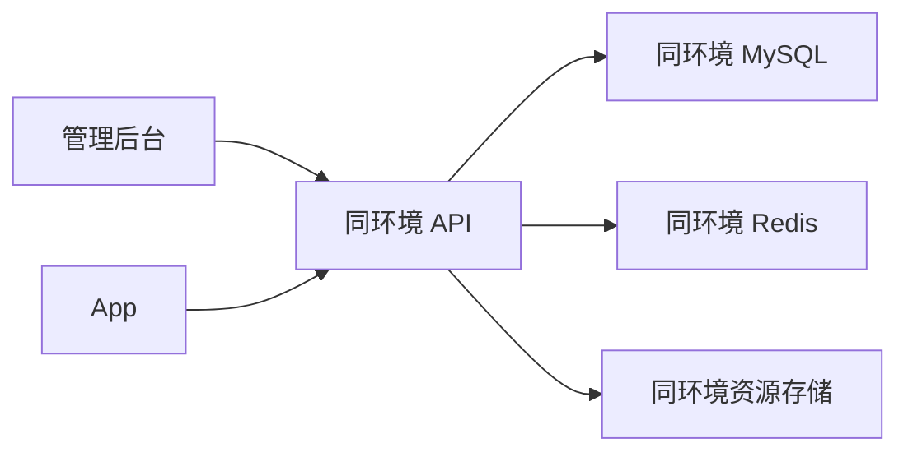

# OPS-005 环境与联调管理规范

**状态：** 草案，待产品与 App 确认

**版本：** 0.3

**日期：** 2026-09-17

**适用范围：** App、Java API、管理后台、数据库、Redis、资源存储及联调人员

## 1. 目的

项目同时存在日常本地环境和 Android 真机隔离环境。两套环境都曾被简称为“本地”，容易出现管理后台连错 API、App 读到另一套数据、清理了错误数据库等问题。

本规范为每套环境分配唯一身份，并规定连接、数据、账号、测试和清理方式。任何联调记录、操作请求和验收结论都必须带环境 ID，不能只写“本地”“测试库”或“线上”。

## 2. 固定环境身份

### 2.1 环境矩阵

| 环境 ID | 中文名称 | 当前状态 | API | MySQL | Redis | 资源目录/存储 | 管理后台 | App 构建 |
|---|---|---|---|---|---|---|---|---|
| `LOCAL_DEV` | 日常本地开发环境 | 已存在 | `http://127.0.0.1:8080` | `127.0.0.1:3307` / `wallpaper_app` | `127.0.0.1:6380` | `.runtime/storage` | 本地 5176，默认代理到 8080 | `localDebug` / `com.qingjing.bizhi.local` |
| `LOCAL_DEVICE` | Android 真机隔离环境 | 已存在 | 电脑 `http://127.0.0.1:8083`；手机经 ADB 访问 `https://127.0.0.1:8443` | `127.0.0.1:3311` / `wallpaper_android` | `127.0.0.1:6391` | `.runtime/android-api12/storage` | 本地 5176，必须显式代理到 8083 | `internal` / `com.qingjing.bizhi.internal`；`lab` / `com.qingjing.bizhi.lab` |
| `ONLINE_MAIN` | 唯一线上服务器环境 | 尚未部署 | 独立 HTTPS 域名，待定 | 同一服务器上的唯一线上 MySQL/schema，名称待部署时确定 | 同一服务器上的唯一线上 Redis | 同一服务器上的持久化资源目录 | 同一服务器部署的后台 | 验证阶段使用 `staging`；生产阶段使用 `prod` / `com.qingjing.bizhi` |

端口和路径是当前工程基线。调整时必须同时修改本表、启动脚本、App 构建配置和相关验收文档，不能只改某一端。

### 2.2 数据用途

| 环境 ID | 允许的数据 | 数据寿命 | 是否可当作生产事实 |
|---|---|---|---|
| `LOCAL_DEV` | 日常开发数据、准备中的正式内容候选、可重复验收数据 | 默认保留，清理需明确范围 | 否 |
| `LOCAL_DEVICE` | 真机联调、4D Lab、安装/卸载、破坏性测试数据 | 可丢弃，但清理仍需明确范围 | 否 |
| `ONLINE_MAIN / VALIDATION` | 准备上线的正式内容、少量可识别并可清理的验收数据 | 持续保留，转生产前清理验收数据 | 尚未正式对外，但作为未来生产数据基线管理 |
| `ONLINE_MAIN / PRODUCTION` | 已审核并正式发布的业务数据 | 长期保留并备份 | 是 |

服务器前期只有这一套线上 MySQL，不再建立或使用“测试数据库”“生产数据库”两套称呼。`ONLINE_MAIN` 在上线前处于 `VALIDATION` 阶段，正式发布时原地切换到 `PRODUCTION` 阶段，数据库事实连续保留。

这里的“一套”只指服务器。开发电脑目前仍有两个彼此隔离的本地数据库：`LOCAL_DEV（3307/wallpaper_app）` 和 `LOCAL_DEVICE（3311/wallpaper_android）`。当前 5176 管理后台显式代理 8083 时，使用的是后者。未来部署 `ONLINE_MAIN` 后，整体就是“两套本地数据库 + 一套线上数据库”，线上没有额外测试库。

正式内容可以先在 `LOCAL_DEV` 制作和核对，但进入 `ONLINE_MAIN` 时必须通过受控的内容导入或正式 API 发布流程。不得把本地数据库、Redis 数据或整个本地资源目录直接覆盖到线上。

### 2.3 真机隔离环境与线上环境的同步边界

`LOCAL_DEVICE` 是 `ONLINE_MAIN` 的上线前验证镜像，但“镜像”指软件和结构一致，不代表两套数据库内容一致。

| 必须保持一致 | 必须保持隔离 |
|---|---|
| Git 提交和 Java API 制品版本 | MySQL 业务数据和自增编号 |
| Flyway 迁移历史与最终 schema | Redis 缓存、会话、票据和幂等状态 |
| OpenAPI 版本、路由和 DTO | 管理员账号、密码和浏览器会话 |
| App 使用的接口、资源包和签名协议 | 设备身份、权益、兑换码和审计数据 |
| 资源目录结构和校验规则 | 实际资源文件与存储路径 |
| 必要环境变量的字段集合 | 数据库密码、主密钥、签名私钥和 TLS 私钥 |

标准发布顺序：

1. 在 `LOCAL_DEVICE` 使用目标 Git 提交、Java 制品和 Flyway 版本完成真机验收。
2. 将同一个已校验制品部署到 `ONLINE_MAIN / VALIDATION`，不在服务器重新修改源码或打补丁。
3. 由线上 API 自己对唯一线上数据库执行对应 Flyway 迁移。
4. 通过管理 API 或受控内容导入，把选定的正式内容提升到线上，并核对资源校验值；不复制整个本地数据库。
5. 在线上以 `staging` App 完成短验收，再按第 8 节切换到生产阶段。

因此，“同步”应写成“`LOCAL_DEVICE` 与 `ONLINE_MAIN` 软件基线一致”，不能写成“本地数据库与线上数据库自动同步”。

## 3. 连接规则

### 3.1 一次联调只能属于一个环境

一条完整链路中的管理后台、API、MySQL、Redis、资源存储和 App 必须属于同一个环境 ID：



禁止以下组合：

- `LOCAL_DEV` 管理后台连接 `LOCAL_DEVICE` API，却按 `LOCAL_DEV` 数据得出结论。
- API 使用 `LOCAL_DEV` MySQL，同时读取 `LOCAL_DEVICE` 的资源目录或 Redis。
- `local`、`internal` 或 `lab` App 连接 `ONLINE_MAIN`。
- `staging` App 在 `ONLINE_MAIN` 已切换为 `PRODUCTION` 后继续执行写入型验收。
- 正式 `prod` App 在 `ONLINE_MAIN` 仍处于 `VALIDATION` 时对外发布。
- App 或管理后台直接连接数据库或资源目录。

### 3.2 当前 App 绑定

- `localDebug` 只用于 `LOCAL_DEV`，地址为 `http://127.0.0.1:8080/api/v1`；真机使用 ADB reverse 映射同一端口。
- `internal` 和 `lab` 当前代码只接受 loopback HTTPS，因此只用于 `LOCAL_DEVICE`，地址为 `https://127.0.0.1:8443/api/v1`。
- `ONLINE_MAIN` 验证阶段新增独立 `staging` flavor、独立 applicationId 和测试签名；它连接未来的正式线上域名，但只能接受服务端 `VALIDATION` 阶段。
- `prod` 只允许 `ONLINE_MAIN / PRODUCTION`。生产阶段没有启用前，默认保留 `https://api.invalid/api/v1`，禁止为了方便把 `prod` 指向验证阶段服务。
- `ONLINE_MAIN` 从验证切换到生产时不换数据库。切换后停止使用 `staging` 做写入型验收，正式 App 使用 `prod`。
- API 地址是构建参数，安装后不可在普通设置页切换。每个 APK 的文件名和交付记录必须标出 flavor、版本号和目标环境 ID。

### 3.3 当前管理后台绑定

- 未设置 `VITE_API_PROXY_TARGET` 时，本地后台属于 `LOCAL_DEV`，代理到 8080。
- 操作 `LOCAL_DEVICE` 前必须显式设置 `VITE_API_PROXY_TARGET=http://127.0.0.1:8083` 并重启 Vite。切换目标后旧浏览器会话作废，重新登录。
- 浏览器地址 `http://127.0.0.1:5176` 不能说明后台连的是哪套 API，验收记录必须同时写代理目标。
- `ONLINE_MAIN` 使用部署在服务器上的固定后台地址。验证阶段和生产阶段共用同一线上数据，但切换生产时必须轮换管理员凭据并收紧操作权限；线上操作不得通过临时修改本地 Vite 代理完成。

### 3.4 当前 API 绑定

- `LOCAL_DEV` 由 `./scripts/local-api.sh` 管理，具体启动规则见 [OPS-001](OPS-001-本地API开发环境.md)。
- `LOCAL_DEVICE` 使用 8083/3311/6391 和独立资源目录，真机 HTTPS/ADB 规则见 [OPS-002](OPS-002-Android真机连接本地API.md)。
- `ONLINE_MAIN` 的 API、MySQL、Redis、后台和资源目录可以部署在同一台服务器，但使用独立容器、Docker 私有网络和持久化卷；MySQL 与 Redis 不映射公网端口。
- 自动测试使用 Testcontainers 或测试专用临时目录，不读写 `LOCAL_DEV`、`LOCAL_DEVICE` 或任何线上持久数据。
- MySQL 是业务事实的唯一来源；Redis 只保存缓存、限流、会话、短时票据和幂等协调状态。

## 4. 操作前的环境声明

每次启动、联调、清理、迁移、导入或验收前，先记录以下内容：

```text
环境 ID：LOCAL_DEV
API：http://127.0.0.1:8080
MySQL：127.0.0.1:3307 / wallpaper_app
Redis：127.0.0.1:6380
资源：.runtime/storage
客户端：管理后台 5176 -> 8080；localDebug
操作范围：例如“只新增正式内容候选，不清理教程和管理员”
```

必须使用“`LOCAL_DEV（3307/wallpaper_app）`”或“`LOCAL_DEVICE（3311/wallpaper_android）`”这样的完整表达。任务、聊天、提交和验收记录中出现单独的“本地库”“测试库”“线上库”，视为目标不明确。

## 5. 数据清理与破坏性操作

### 5.1 请求必须写清的内容

清理请求至少包含：

1. 环境 ID。
2. MySQL 端口和 schema。
3. 删除对象，例如分类、壁纸、资源、权益、兑换、Redis。
4. 保留对象，例如管理员、教程、设备、审计。
5. 是否删除资源文件。

推荐写法：

> 清空 `LOCAL_DEV（API 8080 / MySQL 3307 / wallpaper_app / .runtime/storage）` 的分类、壁纸及其业务资源，保留管理员、教程、设备和教程视频。

“清空所有本地数据”不能直接执行。执行人应先只读列出所有可能环境及数据量，再由请求人明确环境和范围。请求已经包含上述五项时，无需重复确认。

### 5.2 执行流程

所有清理、批量导入和数据库修复使用同一流程：

1. **Plan：** 打印环境 ID、API、数据库、Redis、资源根目录、计划删除/保留的表与文件数量，不写数据。
2. **Apply：** 只对 Plan 中的环境和范围执行；目标发生变化时 Plan 作废，重新生成。
3. **Verify：** 从 MySQL、资源目录、Redis 和公开/管理 API 四处读回结果。
4. **Record：** 记录执行时间、环境 ID、删除/保留数量、验证结果和是否存在未处理项，不记录密码或 Token。

`LOCAL_DEV` 和 `LOCAL_DEVICE` 可以在明确授权范围内清理。`ONLINE_MAIN / VALIDATION` 的清理先生成一致性备份，并明确哪些验收数据可删；它不是一次性测试库。`ONLINE_MAIN / PRODUCTION` 的删除、迁移、发布和数据修复必须走单独生产流程并取得明确确认；本地脚本不得接受线上地址或线上凭据。

### 5.3 数据和文件必须一致

- 删除业务资源记录时同步处理对应资源文件，不能只清数据库后留下不可追踪文件。
- 保留教程时同时保留教程表、资源记录和教程视频文件。
- 清空业务事实后清理对应 Redis 缓存、会话外的短时票据和幂等协调状态，防止旧缓存造成假象。
- 不使用 Redis 反推或恢复业务事实。
- 不跨环境复制管理员密码哈希、设备私钥、会话、兑换码或签名私钥。

## 6. 本地调试规则

### 6.1 日常后台/API 开发

使用 `LOCAL_DEV`：

1. 启动前确认 8080、3307、6380 和 `.runtime/storage`。
2. 管理后台默认代理 8080，并在验收记录中写明 `5176 -> 8080`。
3. App 使用 `localDebug`，真机执行 `adb reverse tcp:8080 tcp:8080`。
4. 需要准备正式内容候选时只在此环境创建，提交前按公开 API 和管理 API 双向读回。

### 6.2 Android 真机、Lab 和破坏性测试

使用 `LOCAL_DEVICE`：

1. 启动前确认 8083、3311、6391 和 `.runtime/android-api12/storage`。
2. 手机只通过 8443 HTTPS loopback 和 ADB reverse 访问 API，不直连电脑局域网端口、MySQL 或 Redis。
3. `internal` 和 `lab` 使用各自 applicationId 与测试签名；证书私钥、Keystore 和密码不进入 Git。
4. 如需后台配合，明确记录 `5176 -> 8083`，使用该环境自己的管理员账号。
5. 卸载、清数据、资源损坏、版本冲突等破坏性验收只在此环境执行。

## 7. 唯一线上服务器的验证阶段

前期只部署一套 `ONLINE_MAIN`，API、管理后台、MySQL、Redis 和资源目录可以在同一台服务器运行。这里没有第二套“测试数据库”：

- 服务使用独立容器和 Docker 私有网络；只对公网开放 HTTPS，MySQL 与 Redis 只允许 API 访问。
- MySQL 和资源目录写入持久化磁盘，不能保存在容器可写层。
- 每日同时备份数据库和资源目录，并把备份复制到服务器之外；发布、迁移和批量清理前额外生成一致性备份。
- `VALIDATION` 阶段只录入准备上线的正式内容，以及数量很少、带明确标识、可在上线前删除的验收账号、兑换码和记录。
- App 使用独立 `staging` flavor，界面持续显示“验证环境”，并可与正式 App 同机安装。
- 每次部署记录代码提交、OpenAPI 版本、Flyway 版本、App 版本和回滚点。
- 验收通过代表这套线上数据可以进入正式发布切换，不代表已经对正式用户开放。

本地破坏性测试仍在 `LOCAL_DEVICE` 完成，不能因为只有一套线上数据库就把随机测试数据长期留在 `ONLINE_MAIN`。

## 8. 同一线上环境转为生产

`ONLINE_MAIN` 正式上线时不新建或迁移到第二套数据库，执行一次受控阶段切换：

1. 暂停管理写入并记录当前代码、Flyway、数据量和资源数量。
2. 同时备份 MySQL 与资源目录，并验证备份可以读取。
3. 删除明确标记的验收账号、兑换码、会话和验收内容，保留审核通过的正式内容。
4. 从管理 API、公开 API、MySQL 和资源目录读回核对。
5. 将服务端阶段从 `VALIDATION` 切换为 `PRODUCTION`，轮换管理员密码和验证期临时凭据；加密主密钥、资源签名密钥等连续性密钥必须按专门迁移方案处理，不能直接替换。
6. 启用 `prod` App，停止 `staging` 的写入型验收并记录正式发布基线。

进入 `PRODUCTION` 后遵守以下规则：

- 生产默认只允许查看健康状态、脱敏日志、指标和只读业务统计。
- 管理后台、API、数据库、Redis、对象存储和 CDN 使用生产专用凭据，凭据不出现在仓库、聊天、截图和验收文档。
- 禁止开启 H5 测试设备、内部诊断、ADB、自签证书、本地资源目录或测试管理员初始化。
- 生产日志不得记录密码、Token、完整兑换码、设备私钥、签名私钥和下载票据。
- 发布、迁移、回滚和数据修复必须先确定提交、制品、备份、影响范围和回滚方案，并在获得生产操作确认后执行。
- 发现问题先在可复现的本地环境验证修复；确需线上处理时只执行已批准的最小变更。

## 9. 账号与密钥规则

- 每个环境使用独立管理员账号和密码；账号属于环境，不属于某台浏览器。
- 登录页只可通过本地环境变量预填用户名，代码和文档不得保存真实密码。
- 初始化管理员只在目标环境尚无账号时执行，不把初始化命令当作重置密码命令。
- API 主密钥、资源签名私钥、TLS 私钥、APK Keystore、数据库密码和 Redis 密码按环境隔离。
- 公共证书和验签公钥可以进入对应测试构建；任何私钥不得进入 APK 或 Git。

## 10. 必须补齐的自动防错门禁

以下项目是本规范确认后的实施项，当前不能把它们描述为已经生效：

1. API 增加固定 `QJ_ENVIRONMENT_ID` 和 `QJ_DEPLOYMENT_STAGE`，在 `/actuator/info` 及响应头返回环境 ID 与 `VALIDATION/PRODUCTION` 阶段。
2. 管理后台启动时读取 API 环境 ID 和阶段，在页面固定显示；环境或阶段未知时禁止写操作。
3. App 构建写入期望环境 ID 和允许阶段，首次请求发现不匹配时拒绝继续，并显示实际值与期望值。
4. 数据库保存单例环境身份和随机 UUID；阶段是可审计的部署配置，不创建第二套数据库。API 启动时核对配置中的环境 ID/UUID，防止连到错误 schema。
5. 数据清理脚本提供 `plan` 和 `apply` 两步命令，输出目标摘要；生产环境在脚本层永久拒绝。
6. CI 校验 `prod` 只接受 `ONLINE_MAIN / PRODUCTION`，`staging` 只接受 `ONLINE_MAIN / VALIDATION`，`local`、`internal`、`lab` 不能使用线上地址。

## 11. 联调和验收清单

### 11.1 开始前

- [ ] 已写明环境 ID、API、MySQL、Redis、资源目录。
- [ ] 管理后台代理、App flavor 和 API 属于同一环境。
- [ ] API readiness 正常，Flyway 版本符合本次代码。
- [ ] 使用的是该环境自己的账号、密钥和证书。
- [ ] 已记录操作范围和允许保留的数据。

### 11.2 完成后

- [ ] 从 API 和 MySQL 读回同一业务结果。
- [ ] 资源记录、实际文件和校验值一致。
- [ ] Redis 重启或清理后，MySQL 业务事实仍可恢复。
- [ ] 验收记录包含环境 ID、代码提交、App 版本和未测范围。
- [ ] 未把运行时文件、密码、Token、私钥或生产数据加入 Git。

## 12. 给 App 团队的同步结论

1. 当前 `local` 只连 `LOCAL_DEV`；`internal` 和 `lab` 只连 `LOCAL_DEVICE`。
2. 服务器只有一个 `ONLINE_MAIN` 和一套线上数据库：上线前是 `VALIDATION`，上线后原地切换为 `PRODUCTION`。
3. 线上验证新增 `staging` flavor，不临时复用现有 flavor；建议 applicationId 为 `com.qingjing.bizhi.staging`。正式发布使用 `prod`。
4. App 内不提供用户可编辑的 API 地址。构建时写入目标环境 ID、允许阶段和 API 地址，运行时核对 API 返回的环境 ID 与阶段。
5. 每个测试包的名称或页面必须能辨认环境，交付文件名必须带 flavor、版本和环境 ID。
6. App 只通过 API 获取目录、权益和资源，永远不连接 MySQL、Redis 或资源目录。

## 13. 待确认项

建议按以下结论确认后实施：

- 为 `ONLINE_MAIN / VALIDATION` 新增独立 `staging` flavor 与 `.staging` applicationId。
- 本轮先实现 API、管理后台和 App 的环境 ID、部署阶段握手，再实现数据库 UUID 与清理脚本两步门禁。
- 正式内容从 `LOCAL_DEV` 到 `ONLINE_MAIN` 使用受控导入/发布流程，不复制数据库和运行时目录。
