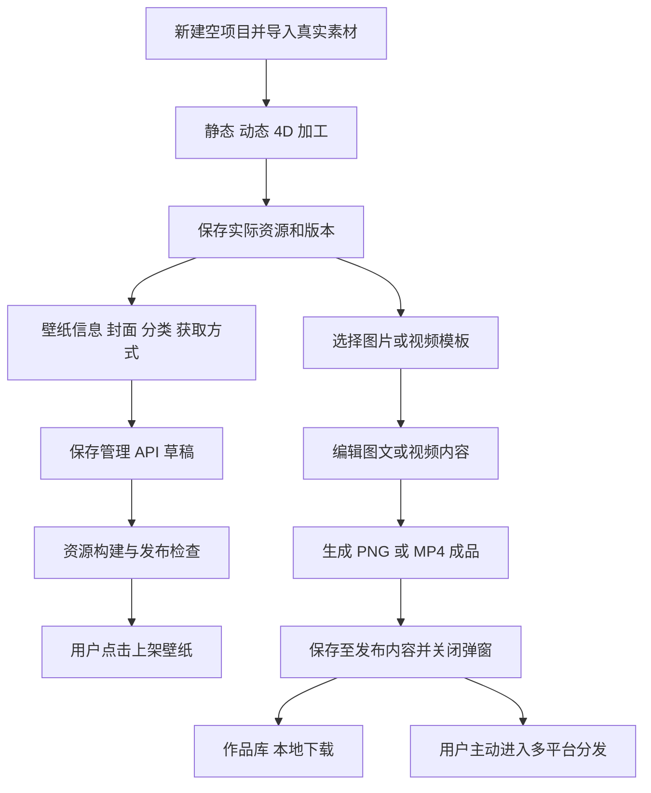

# 创作台正式版开发交接与 API 需求

创作台正式版保留现有编辑器，将真实素材导入、壁纸加工、壁纸上架、推广内容制作和成品保存串成可恢复的业务流程。创作台在本机运行；壁纸与发布状态由壁纸管理 API 确认，项目和任务由 MySQL 持久保存，文件通过存储 Adapter 管理。抖音和小红书分发放在最后一阶段。

版本日期：2026 年 10 月 6 日。代码基线：`a3bbfb3`，创作台资源版本 `0.8.0`，主 OpenAPI 版本 `2.15.0`。本文面向创作台前端、本地处理服务、壁纸 API 和 App 开发人员。文中“现有”表示当前代码具有此能力；“新增设计”表示需要开发的目标接口，不代表接口已经上线或已经验收。

## 一 正式版范围与交付目标

### 1 用户业务与技术目标

| 视角 | 要解决的问题 | 正式版结果 |
| --- | --- | --- |
| 使用者 | 素材重复导入，生成慢，不知道保存和上架是否真正成功 | 本机导入一次，多处复用；显示真实进度；失败后能继续；状态有可查询的依据 |
| 内容运营 | 一张壁纸包含静态图、安卓视频、鸿蒙动态照片、iOS 源视频或 4D 包，还需制作推广内容 | 同一项目管理各平台资源；一个壁纸商品关联多个资源变体；推广成品独立保存 |
| 开发维护 | 创作台中部分数据只是浏览器记录，部分 UI 字段还没有服务端契约 | 复用已有管理 API，新增项目和任务能力；统一校验规则；不再写入模拟上架状态 |

首版针对单业务主体、本机操作者，不新增多租户、RBAC、在线协作或 H5。本次为创作台正式化，不自动开启整个壁纸 App 的 2.0 规划，也不改写冻结的 1.0 看板与历史文档。

### 2 三种发布必须分清

| 操作 | 产物与存放位置 | 成功标准 | 页面行为 |
| --- | --- | --- | --- |
| 壁纸上架 | 壁纸业务记录、平台资源版本、App 可用的交付资源 | 管理 API 返回并可重新查询 `PUBLISHED`，对应资源版本有效 | 留在创作台，显示壁纸 ID、环境和平台状态 |
| 生成作品 | 实际 PNG 图片组或 MP4 视频，加入项目的发布内容与作品库 | 成品文件及作品记录均持久保存 | “保存至发布内容”后关闭弹窗，保持当前编辑页 |
| 平台分发 | 抖音或小红书发布任务 | 以后单独确认平台提交、审核、发布结果 | 用户明确点击下一步或分发时进入；本阶段不自动触发 |

“导出视频”和素材右键“导出到本地”只下载文件，不自动创建壁纸商品，不自动加入素材收藏，不自动发布到社交平台。用户主动收藏后，素材才进入音频库、图片库、视频库或可编辑文字收藏。

### 3 本地部署的含义

创作台页面、本地素材、合成与编码任务都在本机。默认连接本地壁纸 API、MySQL、Redis 和资源存储。页面使用 `127.0.0.1`，服务默认只监听回环地址。

未来若需要把真实商品上架到正式壁纸库，可在本地创作台中连接经授权的正式管理 API；此时仍有素材上传耗时。本机运行创作台与向哪个业务环境上架是两件事。首版不包含生产发布、生产迁移、生产数据同步，也不允许连接失败时自动切换环境。

目前图片处理和视频生成已经在本机进行。本地正式化主要减少重复生成与重复搬运，不能仅靠换部署方式保证编码变快。原始素材、壁纸交付资源、推广成品分别使用自己的质量配置；降低编辑预览分辨率不得改变正式输出。

## 二 当前能力与缺口

### 1 前端现状

| 模块 | 当前代码实际能力 | 正式版缺口 | 优先级 |
| --- | --- | --- | --- |
| 项目 | IndexedDB 保存项目、素材、历史、复制和回收站 | MySQL 项目记录、文件持久化、浏览器缓存迁移、完整备份与恢复 | P0 |
| 新建项目 | 新建非示例项目仍注入 `demoAssets()`；首次打开自动创建示例 | 默认空项目；示例必须由用户主动打开，不能作为真实上传来源 | P0 |
| 原始素材 | 导入图片、视频、4D ZIP，读取部分尺寸与时长；素材可下载 | 服务端探测真实编码、音轨、帧数和哈希；原始素材文件 ID；引用完整性 | P0 |
| 静态壁纸 | 设备尺寸裁剪、截图、保存处理图与缩略图 | 处理结果持久化、封面用途区分、与真实商品关联 | P0 |
| 动态壁纸 | 安卓、鸿蒙、iOS 独立剪辑工程，本地 FFmpeg 导出 | 统一平台约束、保存“剪辑方案”和“实际资源文件”的不同状态、可恢复任务 | P0 |
| 4D 资源 | 导入、预览与保留原始 ZIP | 接入既有源包导入接口、展示服务端校验结果、保留源包 ID | P0 |
| 创建壁纸 | 有分类、封面、获取方式、资源清单等表单 | 分类仍为示例；`createDemoProduct()` 只存本地模拟商品，没有真实上传、变体、资源版本与上架调用 | P0 |
| 图片编辑 | 画框、组件、实例、蒙版、效果、文字与叠加方式等已在代码中实现 | 保留现有功能，接入正式文件引用、字体依赖记录和模板持久化 | P0 |
| 视频编辑 | 多轨、元素选择、文字、图片、音频、叠加方式、画布与输出设置已有实现 | 与图片编辑共用素材身份；输出快照、真实任务、音轨信息与产物复用 | P0 |
| 模板与收藏 | 模板、音频、图片、视频及文字收藏分别存在本地数据库 | 统一持久化和备份；保留命名、文字可编辑属性及模板引用 | P0 |
| 作品库 | 实际生成文件，保存至发布内容后关闭弹窗 | 成品文件、生成参数、来源版本和业务记录持久化；与素材库分开 | P0 |
| 自动保存 | 浏览器内有保存队列与失败提示 | 区分“浏览器缓存已保存”和“项目已持久保存”；处理冲突与断开连接 | P0 |
| 社交分发 | 已有本地桥接、账号、任务、基础指标及 MySQL 记录 | 真平台上传参数与结果验收、完整数据看板等 | P2 本轮后置 |

已有编辑功能不能直接等同于正式版已经验收，也不能因尚未接 API 就整套重写。保留 `studio.js`、现有 Canvas 渲染与时间轴模型，先抽出项目仓库、任务仓库和壁纸发布协调模块；本轮不要求换框架。

### 2 后端与本地服务现状

| 层次 | 已有能力 | 主要缺口 |
| --- | --- | --- |
| 壁纸 Java API | 管理登录、分类树、资源上传、壁纸草稿与修改、变体、资源版本、发布、下架、归档 | 创作台未接入；缺少集中规则查询、发布预检查和持久任务协调 |
| 平台交付 | 安卓与静态资源安全包及独立预览包、4D 源 ZIP 导入、鸿蒙 Moving Photo 生成、iOS 预览与原始 MP4 下载 | 处理调用主要是同步调用；构建状态需要集中展示与恢复；部分前端预设与服务端冲突 |
| iOS 获取配置 | `productId`、`firstFreeEligible`、`enabled`、商品锁定及交易核验时间 | 当前 Java DTO 与主 OpenAPI 没有创作台 UI 中的 `credits`、`acquisitionMode`、`priceSyncStatus` 等字段 |
| 本地 Python 服务 | 提供页面与 FFmpeg 渲染；视频内容可接受浏览器预编码 H.264，或 JPEG 帧序列与音频后合成 | 临时目录随请求结束清理；没有持久任务队列与缓存；请求断开可取消；全局锁忙时返回 429 |
| 数据保存 | 正式业务已有 MySQL 与 FileStorage；分发已有业务表 | 创作项目、生成任务、模板、收藏、作品还主要在浏览器里 |

后端不需要重做一套壁纸发布 API。最重要的是把既有能力接通，并增加创作数据、任务和发布协调能力。

### 3 必须处理的现有规则冲突

| 问题 | 当前事实 | 正式版处理 |
| --- | --- | --- |
| iOS 帧数 | 创作台接受 16–30 帧；后端 `createLivePhotoVideo()` 要求至少 60 个显示帧，取前 60 帧重定时为 60 fps 的 1 秒预览 | 以当前后端规则作为首版规则；创作台生成用于上传的 iOS MP4 至少包含 60 个显示帧，删除 16–30 帧成功提示；规则从 API 读取。按当前 30 fps 导出，至少需 2 秒 |
| iOS 正式下载 | 当前交付接口下载 `LIVE_PHOTO_SOURCE` 原始 MP4；预览仍使用服务端派生视频 | 不让创作台把 HEIC 加 MOV 当成正式上传必需品；不得用 1 秒预览视频替换源 MP4；资源类型枚举仍保留 `IOS/LIVE_PHOTO` |
| iOS MOV | 上传用途允许 MP4/MOV，但当前原始视频交付查询要求 `mime_type='video/mp4'` | iOS 正式输出统一 MP4；MOV 导入可以转换，不得显示为已可交付。后端预检查补齐这一条件 |
| 安卓时长 | 创作台显示可保留当前长度；包检查接受的视频时长不超过 30 秒 | 安卓壁纸输出限制与包检查保持一致，上传前明确提示；不能把推广视频的时长设置套到壁纸 |
| 上传限制 | 壁纸 VIDEO 等用途 200 MiB，源 4D ZIP 100 MiB；本地渲染请求包上限 512 MiB | 分别显示素材导入、渲染传输、壁纸上架限制；不复用社交分发 2 GiB 视频限制 |
| 积分售价 | 创作台有积分定价 UI，当前正式获取接口仍为非消耗型商品配置 | 首版保留当前已实现的非消耗型规则。积分售价放入独立支付开发包，在 App、订单、权益和 Apple 商品逻辑完成前不得启用为正式保存字段 |
| 仅线下推广 | 前端有开关与展示说明，当前商品 DTO 和主契约没有对应字段 | 新增后端可见范围并贯穿 App 查询和交付鉴权；未完成前不允许开关宣称已生效 |
| 预览水印 | 前端绘制了一层展示水印，当前商品接口没有此开关；已有独立预览包不等于水印策略已实现 | 水印由后端按预览用途派生；正式文件保持不变；模板里视觉水印与 App 预览水印分别管理 |
| 内容视频长度 | 本地 `render_content()` 当前限制内容帧数最多 30 秒乘以 fps | 首版输出设置同步限制 30 秒；长视频作为后续能力扩展，必须同时调整浏览器、任务、编码与存储限制 |

以上是仓库当前代码规则，不是所有手机平台的通用限制。原始输入可比交付资源更大或更长，但必须能明确加工出符合目标规则的资源。

## 三 正式流程与信息结构

### 1 主流程



推广内容制作不强制等待壁纸上架成功。尚未上架时可生成与保存作品，但引用上架链接、兑换方式等商品信息必须明确来自哪一个环境和商品版本，不能填入示例商品 ID。

### 2 页面与导航

顶层仍保持“壁纸创作 → 内容创作 → 平台分发”。项目入口与保存状态贯穿各页面，任务中心采用弹窗或侧面板，避免另开一套复杂导航。

| 页面或弹窗 | 必须展示的信息 | 关键操作 |
| --- | --- | --- |
| 项目列表 | 名称、缩略图、更新时间、是否持久保存、关联商品状态 | 新建空项目、打开、改名、复制、回收站、备份与恢复 |
| 壁纸创作 | 原始素材、静态裁剪、各平台剪辑、4D 预览、实际加工结果 | 保存资源、导出资源、进入创建壁纸或内容创作 |
| 创建壁纸 | 当前环境、真实分类、元数据、封面、每个平台的准备状态 | 保存草稿、检查发布条件、上架；已有商品可更新与下架 |
| 内容创作 | 图片编辑、视频编辑、模板、资源引用、输出设置 | 生成作品、导出本地文件 |
| 素材库弹窗 | 音频、图片、视频、可编辑文字分类；搜索与我的收藏 | 预览、收藏并命名、重命名、复用、移除收藏；素材卡及时间轴右键收藏和下载 |
| 作品库弹窗 | 作品名称、图片组或视频、生成时间、来源与输出版本 | 预览、下载、显式进入下一步 |
| 任务中心 | 编码、上传、派生构建、上架的阶段与状态 | 取消可取消步骤、重试、查看需要用户处理的原因 |
| 连接设置 | 本地处理服务状态、当前管理 API 环境、登录状态 | 连接本地 API、登录、退出；可配置其他经授权环境 |

图标继续使用简单线条；素材库采用弹窗。视频轨道前方最多区分视频与音频，并保留可见、锁定、声音和独播等必要操作。点击画布外围显示画布与输出设置，选中元素显示属性及四周交互边框。取消选择不会改变素材或成品。

### 3 统一资源身份

所有资源以不可变文件 ID 引用；`blob:` URL 只作为当前页面缓存，不得进入正式项目记录。保留原始媒体、加工结果与成品之间的关系。

| 对象 | 示例 | 核心标识与引用 |
| --- | --- | --- |
| 原始素材 | 导入的 MP4、PNG、音乐、4D ZIP | `creatorMediaId`、SHA-256、原始文件名、探测信息 |
| 壁纸加工方案 | 安卓时间轴、静态裁剪、iOS 输出方案 | `resourceDraftId`、项目修订、源素材 ID、完整参数 |
| 壁纸加工结果 | 已编码安卓 MP4、鸿蒙源视频、静态 PNG | `artifactId`、方案哈希、输出文件 ID、技术信息 |
| 上架资源 | 管理 API asset、4D source package、资源版本 | `assetId` 或 `sourcePackageId`、`variantId`、`resourceVersionId`，绑定环境 ID |
| 内容草稿 | 图片画框与组件、视频多轨与文字 | `contentDraftId`、schemaVersion、素材引用、模板版本 |
| 作品 | 一组顺序图片或一个视频 | `workId`、草稿修订、输出参数、文件清单与顺序 |
| 收藏 | 命名音乐或可编辑文字 | `favoriteId`、素材 ID 或文字属性快照 |

同一份文件可以被多个草稿与收藏引用。删除收藏不删除文件，删除图层不删除原始素材。被有效项目、作品或任务引用的文件不能由垃圾清理删除。

## 四 前端开发要求

### 1 空项目与示例隔离

新建项目只包含空资源区与空时间轴。若使用内置模板，可保留布局和样机造型，不默认填入示例铁人图片、示例视频或示例商品。

示例项目放在独立“打开示例”操作下，明确标记。示例可以保存为自己的副本，但正式上架必须使用实际已保存文件，不能使用 `demo:true`、固定示例 URL 或虚拟商品记录。旧的 `prototype:true` 商品仅迁移为本地创作草稿，并清空模拟发布状态；不将 `demo-...` ID 当作管理 API ID。

### 2 素材导入与保存

导入后立即保存文件并取得持久 ID，后台探测实际 MIME、宽高、时长、显示帧数、帧率、编码和音轨。编辑器可以先展示本机缓存，但必须标记“正在保存素材”，在持久保存完成之前禁用依赖该文件的上架操作。

缺失文件显示具体名称，并允许重新选择文件。重新关联时先比较 SHA-256；文件内容不同则创建新素材并提示引用更新，不能悄悄替换历史成品的来源。多文件导入分别返回成功或失败，不因一项失败丢掉其余已完成项。

音轨探测用于告诉用户视频是否自带声音。视频轨道的声音开关控制预览与内容成品混音；图片轨道保留一致的交互位置，但没有音轨时禁用并提示“此轨道没有音频”。壁纸交付视频按既有交付规则输出，推广视频可带音频，不能共用一个静音变量。

### 3 保存方案与生成资源

“保存剪辑”保存可编辑时间轴；“生成资源”生成实际文件。未编码的剪辑不能显示为“资源已就绪”。静态加工结果与 ZIP 导入也需返回实际文件身份和校验结果。

每个平台资源卡显示：来源修订、输出宽高、帧率、帧数与时长、文件大小、准备状态、最近错误。编辑已生成资源的方案时，显示“方案已修改，需重新生成”，保留上一份有效结果供下载与明确选择，不自动覆盖历史版本。

内容创作拖入加工视频时，优先使用同一方案对应的有效成品；无成品才发起生成任务。原始素材仍可直接使用，但必须标记原始或已加工，不能仅凭存在时间轴就标记“已加工”。

### 4 创建和上架壁纸

正常流程：选用已就绪资源 → 填写真实分类与商品信息 → 保存 API 草稿 → 构建所需交付与预览 → 查看预检查 → 用户点击上架 → API 查询确认状态。

表单必须补齐 `copyrightNote`；Slug 自动产生稳定唯一值，更新保持原值。商品元数据、iOS 获取配置和资源步骤分别显示状态。无需用户手动填写 asset 或 version ID，但前端必须保留这些 ID 及其所属环境。

“保存草稿”与“上架壁纸”是两个明确按钮。保存草稿不会上架；上架时提交所选资源版本集合。同一变体只选择一个版本。更新已有商品时展示将替换的发布资源，不能把“保存编辑”当成自动替换线上交付文件。

商品和变体修改必须使用最新 `If-Match`。收到 412 时保留当前输入，读取最新版本并显示差异，让用户合并或重新提交；禁止无提示覆盖。后台存在未选中的其他已发布变体时，展示本次完整发布集合，避免调用 publish 后意外退休掉其他平台版本。

异常流程：登录失效暂停远端提交但保留项目；编码失败只重试编码；上传失败复用已上传文件；资源构建失败保留 API 草稿和资源 ID；上架结果未知先查询状态，不再次创建商品。

### 5 内容制作与作品保存

保留现有图片和视频编辑器：双击改名、组件与实例、解除关联与删除、画布外文字、蒙版和 Cmd+M、效果、圆角、透明度、叠加方式、文字字体大小颜色、元素选择与交互边框。蒙版等操作在存在文字输入焦点时不得抢占输入快捷键。

创建组件、关联删除、跨轨移动、片段接头吸附反馈和右键编辑菜单必须保持已有设计。右键中没有实现的动作不要作为可点击条目展示。浏览器原生右键只在创作工作区内替换，不影响其他页面。

视频时长默认“跟随最后一个片段”，取有效片段的最大结束时间。项目帧率与输出帧率分别记录；首版默认输出跟随项目。画布尺寸变化不自动改变原始素材，输出尺寸变化不回写编辑布局。当前内容生成支持 24、25、30、50、60 fps 与最长 30 秒，实际可用上限由能力接口提供。

作品生成使用点击时的不可变草稿快照，用户继续编辑不会影响在生成的作品。已生成作品保留来源版本，后续修改模板、组件或原始草稿不会改变成品文件。预览弹窗点击“保存至发布内容”后，成功保存文件与记录再关闭弹窗；保存失败保留预览，不丢掉刚生成的文件。

文字收藏保存文字内容、字体、大小、颜色、样式、布局、圆角和叠加方式等可编辑属性，不保存为只能复用的位图。字体无法找到时明确提示，并提供替换字体；不能默默以另一字体生成正式成品。

### 6 自动保存与数据迁移

编辑变化先写浏览器缓存，再提交服务端持久修订。状态至少区分“保存中”“项目已保存”“已缓存，等待连接”“保存失败”和“有版本冲突”。只有持久写入成功才显示“项目已保存”。

服务断开后可继续编辑已经缓存的素材，暂停生成和上架，恢复连接后顺序提交。项目切换之前必须处理待保存变化；切换失败保留当前项目。两个页面同时修改同一项目时，通过版本锁防止覆盖。

首次升级提供“迁移本机项目”弹窗：读取现有三个 IndexedDB 数据库中的项目、素材、模板与收藏，逐项持久化并生成映射。迁移可重试，同一来源 ID 不重复创建；模拟商品转草稿；缺失 Blob 列出文件名称。迁移成功后保留原缓存，用户确认备份可用后再清理。

项目备份包含草稿、模板快照、收藏、必要字体或字体引用、媒体文件、成品及哈希清单，不只是当前资源导出 ZIP。备份不包含密码、Cookie、社交平台登录态或签名私钥。导入备份时校验结构、schemaVersion、哈希和引用，并产生新的项目 ID；历史商品关联仅作为来源信息，不自动写入任何业务环境。

## 五 服务划分与数据保存

### 1 职责边界

| 部分 | 负责 | 不负责 |
| --- | --- | --- |
| 创作台前端 | 编辑交互、缓存、冻结草稿快照、任务展示 | 直接连接 MySQL、拼接资源目录、判断商品已上架 |
| 本地处理服务 | 文件探测、FFmpeg、浏览器画面编码阶段、进度与产物上传 | 保存商品业务事实、私自绕过管理 API 上架 |
| Java 管理 API | 项目与文件关系、任务与租约、商品编排、校验与正式发布、审计 | 将浏览器 URL 或本机绝对路径作为业务标识 |
| MySQL | 项目、修订、作品、收藏、任务、商品、资源版本等业务事实 | 存大媒体二进制 |
| FileStorage Adapter | 以 StorageKey 存原始与派生文件，供授权接口读取 | 向业务层暴露绝对文件路径 |
| Redis | 短时会话、协调、限流等 | 作为项目或任务唯一存储 |

本地目录由存储与媒体处理基础设施管理。Java 与 Python 之间通过管理 API 取得文件与回传产物；Python 可使用临时工作目录，不得绕过资源 Adapter 读取正式资源目录或写业务表。

### 2 新增数据模型

下表为逻辑模型，最终表名可遵循工程命名；关系和唯一约束必须保留。

| 对象 | 必须保存的字段与约束 |
| --- | --- |
| `creator_project` | ID、名称、schemaVersion、当前修订、缩略图文件 ID、回收时间、创建与更新时间、lockVersion |
| `creator_project_revision` | projectId、revisionNo、完整可恢复 JSON 快照、manifestSha256、提交人、时间；项目加修订号唯一 |
| `creator_media` | ID、kind、用途、storageKey、SHA-256、MIME、大小、原名、尺寸、时长、帧率、帧数、编码、音轨信息、状态；客户端去重键唯一 |
| `creator_resource_artifact` | 项目、平台、方案哈希、源修订、输出配置、rendererVersion、媒体 ID、实际探测信息、状态 |
| `creator_content_draft` | 项目、类型、schemaVersion、可编辑 JSON、模板 ID 与版本、修订锁 |
| `creator_template` | 名称、图片或视频类型、快照版本、媒体引用、回收时间、版本锁；修改创建新模板版本 |
| `creator_favorite` | 名称、audio/image/video/text 类型、媒体或文字快照、创建时间、版本锁 |
| `creator_work` 与文件明细 | 名称、项目、草稿版本、输出配置、生成任务、图片序号或视频文件、时间；taskId 去重 |
| `creator_task` 与步骤明细 | 类型、状态、冻结输入、输入哈希、阶段、进度、步骤输出 ID、错误码、runner、租约、attempt、时间；幂等键与参数哈希 |
| `creator_wallpaper_link` | 项目、环境 ID、wallpaperId、最近同步版本、资源映射、最近发布任务；项目加环境唯一关联 |

JSON 用于保存现有编辑模型，不在第一阶段拆成每一个图层一张关系表。文件引用、任务、作品和商品关系则使用可索引字段与关系表，便于完整性检查与清理。图库和视频轨道内素材一律引用 `creatorMediaId`，不重复保存文件。

软删除项目与模板后，默认保留 30 天；首版提供主动恢复和永久删除。文件只在不被有效项目、模板、作品、收藏或未结束任务引用，且超过保留期后清理。先构造保留引用集合再清理，不根据浏览器当前打开状态判断。

### 3 项目与文件恢复

项目快照保存及引用校验在同一数据库事务内完成；文件先暂存、校验、提交，再绑定项目。失败留下的孤立文件进入可清理队列，不作为成功素材显示。

备份与恢复由授权任务执行，限制路径、ZIP 解压体积、条目数与校验开销，不允许压缩包包含任意执行脚本。首版备份包上限采用可配置 2 GiB、解压上限 4 GiB；大型项目超限时清楚提示，后续分卷能力另行开发。恢复仅写入本地所选环境中的创作项目，不复制商品业务数据。

本机正式运行也需要同时备份 MySQL 与存储 Adapter 中的文件。单独备份数据库无法恢复媒体，单独复制文件无法恢复引用；提供同一快照标识及清单。默认由用户主动备份，不创建未经要求的定时任务。

## 六 可直接复用的壁纸管理 API

以下为当前已实现接口。路径统一以 `/api/v1` 为前缀；表中省略此前缀。完整 Schema 以 `contracts/openapi/openapi.yaml` 和现有 Java DTO 为准。

### 1 登录与分类

| 方法与路径 | 用途 | 接入注意 |
| --- | --- | --- |
| `POST /admin/sessions` | 管理员登录 | JSON：`username`、`password`；返回 admin、csrfToken、expiresAt，并设置 HttpOnly 会话 Cookie |
| `GET /admin/sessions` | 获取当前会话 | 页面恢复时读取；不把密码写入项目 |
| `DELETE /admin/sessions` | 退出 | 退出后暂停需授权任务，保留草稿 |
| `GET /admin/categories` | 查询真实分类树 | 默认不取删除分类；返回一级及 children；空树提示先配置分类 |
| `GET /admin/categories/{categoryId}` | 分类详情 | 处理分类被删除、层级或所属关系改变 |

前端请求带 Cookie；写操作按既有规则发送 `X-CSRF-Token`。客户端生成 `X-Request-Id` 用于关联错误与日志。更新所需 ETag 是带双引号的版本，例如 `"7"`；`If-Match` 必须原样发送，不能发数字 `7`。

首版沿用本地桥接的同源思路，扩展成通用管理 API 代理，复用会话和 CSRF 逻辑；仅允许预定义路由、方法和当前配置的本地 API 地址，不能成为任意 URL 代理。现有分发桥接仅允许 loopback HTTP，不能直接宣称已经支持远程环境。远程管理 API 接入属于后续独立扩展。

### 2 素材与商品

| 方法与路径 | 用途 | 必须处理的返回 |
| --- | --- | --- |
| `POST /admin/assets` | 上传正式壁纸资源 | multipart：purpose、file；201 返回 AdminAssetView，必须检查 validationStatus |
| `GET /admin/assets/{assetId}` | 读取资产元数据 | SHA-256、MIME、大小、宽高、时长、validationStatus 与错误码 |
| `GET /admin/assets/{assetId}/content` | 管理端授权读取 | 不绕过 API 访问资源目录；不作为 App 公开下载地址 |
| `GET /admin/wallpapers` | 查询真实商品 | page、pageSize、status、accessType、categoryId、q |
| `POST /admin/wallpapers` | 创建真实 DRAFT 商品 | 返回真实 ID、version 和 ETag；此步骤不意味着上架 |
| `GET /admin/wallpapers/{wallpaperId}` | 详情与状态 | variants、资源版本、iosAcquisition，恢复时以此为准 |
| `PATCH /admin/wallpapers/{wallpaperId}` | 修改商品元数据 | 完整 WallpaperWriteRequest，必须 If-Match；不能当作任意部分字段 Patch |
| `DELETE /admin/wallpapers/{wallpaperId}` | 删除草稿 | 必须 If-Match；已上架商品不走草稿删除 |
| `POST /admin/wallpapers/{wallpaperId}/offline` | 下架 | If-Match；reason 按既有接口记录 |
| `POST /admin/wallpapers/{wallpaperId}/archive` | 归档 | If-Match、必填 reason；归档商品不能继续上架 |

商品表单字段映射如下。

| 前端名称 | 现有请求字段 | 规则 |
| --- | --- | --- |
| 壁纸名称 | title | 必填，1–40 字符 |
| 自动标识 | slug | 必填，2–64 字符，小写字母数字加短横线；创建后保持稳定 |
| 获取方式 | accessType | `FREE` 或 `REDEEM`，不等同于 iOS 购买配置 |
| 一级分类 | rootCategoryId | 必填，真实正整数 ID 的字符串形式 |
| 二级分类 | childCategoryId | 可空；必须是一级分类的直接子节点 |
| 列表封面 | coverAssetId | 必填；新封面必须以 `WALLPAPER_COVER` 用途上传 |
| 排序 | sortOrder | 必填，0–999999 整数 |
| 精选排序 | featuredRank | 可空，0–999999 整数；为空表示不加入精选 |
| 版权说明 | copyrightNote | 必填，1–500 字符；不得默认把“平台内容”作为所有素材的权利证明 |

示例请求中的 ID 只演示数据结构，实际值必须来自当前 API：

```json
{
  "title": "城市光影",
  "slug": "wallpaper-8d613abc",
  "accessType": "REDEEM",
  "rootCategoryId": "12",
  "childCategoryId": "18",
  "coverAssetId": "204",
  "featuredRank": null,
  "sortOrder": 10,
  "copyrightNote": "自有原创素材"
}
```

`offlinePromotionOnly`、`previewWatermarkEnabled` 和积分售价不是当前 WallpaperWriteRequest 的字段，不能往既有 JSON 里加上字段后就认为已经保存。正式接入前后端都需拒绝不支持的字段或明确提示未生效。

### 3 平台资源映射与上传限制

| 创作资源 | platform | resourceType | 上传 purpose | 绑定 role | 当前单文件上限 |
| --- | --- | --- | --- | --- | --- |
| 列表封面 | 商品字段 | 不建资源变体 | WALLPAPER_COVER | 使用 coverAssetId | 20 MiB |
| 静态壁纸 | UNIVERSAL | STATIC_IMAGE | STATIC_IMAGE | STATIC_IMAGE | 50 MiB |
| 安卓动态视频 | ANDROID | VIDEO | VIDEO | VIDEO | 200 MiB |
| iOS 原始视频 | IOS | LIVE_PHOTO | LIVE_PHOTO_SOURCE | LIVE_PHOTO_SOURCE | 200 MiB |
| 鸿蒙源视频 | HARMONYOS | MOVING_PHOTO | MOVING_PHOTO_SOURCE | MOVING_PHOTO_SOURCE | 200 MiB |
| 安卓 4D | ANDROID | LAYER_PARALLAX | 专用 ZIP 导入 | 专用资源版本接口产生绑定 | ZIP 100 MiB |

封面与静态图允许 JPEG、PNG、WebP；安卓视频和 iOS 上传用途目前允许 MP4、QuickTime；鸿蒙源视频只允许 MP4。iOS 正式版统一提供 MP4，以满足现有原始文件交付查询。

4D 使用专用 ZIP 流程：根目录 `config.json` 与 `layers/01...` 连续编号的 2–12 层，最后一层为完全不透明背景，其余层为带透明通道的 PNG 或 WebP；画布宽高各 512–4096。当前包校验要求 formatVersion 至少为 2，config 不超过 64 KiB，展开总量不超过 85 MiB，图层加 config 有效载荷不超过 64 MiB。首版前端使用自己明确支持的版本；遇到高于前端理解范围的格式必须提示兼容性，不能重新序列化破坏原始配置。

源 ZIP 的 `cover.jpg` 不作为商品列表封面。4D 上传保持原始 ZIP 和 config 原字节，通过既有专用接口解析与生成资源绑定。

### 4 资源版本与上架调用

| 方法与路径 | 用途 | 请求要点 |
| --- | --- | --- |
| `POST /admin/wallpapers/{id}/variants` | 创建平台资源变体 | If-Match 使用商品版本；platform、resourceType、minimumOsVersion、capabilityRequirements、enabled |
| `PATCH /admin/variants/{id}` | 修改或停用变体 | If-Match 使用变体版本；修改后重新查询商品版本 |
| `DELETE /admin/variants/{id}` | 删除允许删除的变体 | If-Match；有发布引用时按既有规则处理 |
| `POST /admin/variants/{id}/resource-versions` | 创建普通资源版本 | versionNo、可空 manifestSha256、bindings；每条为 assetId、role、ordinal |
| `POST /admin/parallax-packages` | 导入原始 4D ZIP | multipart file；SHA-256 相同且有效的源包可复用，200 或 201 |
| `POST /admin/variants/{id}/parallax-resource-versions` | 用源包创建 4D 版本 | versionNo、sourcePackageId；已有同版本同源包可以复用 |
| `GET /admin/resource-versions/{id}` | 查询版本与派生结果 | status、validationErrors、sourcePackage、movingPhoto、livePhoto |
| `POST /admin/resource-versions/{id}/secure-package` | 构建安全交付包与独立预览包 | 安卓及通用静态使用；任务化后仍复用内部现有服务 |
| `POST /admin/resource-versions/{id}/moving-photo` | 构建或重试鸿蒙派生资源 | 检查 movingPhoto.status 与 publishable |
| `POST /admin/resource-versions/{id}/live-photo/build` | 构建或重试 iOS 预览资源 | 检查 livePhoto.status、错误和 publishable；不替换正式源 MP4 |
| `POST /admin/wallpapers/{id}/publish` | 正式上架 | If-Match 使用最新商品版本；resourceVersionIds 是本次完整发布版本集合 |

普通资源版本示例：

```json
{
  "versionNo": 1,
  "manifestSha256": null,
  "bindings": [
    {"assetId": "205", "role": "VIDEO", "ordinal": 0}
  ]
}
```

versionNo 以服务端现有版本最大值加 1，不使用客户端时间。普通资源版本创建接口目前没有请求级幂等保证，相同 versionNo 冲突也不意味着内容相同；新发布协调模块必须记录绑定清单与步骤结果。

创建变体会改变商品版本，构建安全包也可能改变资源版本的 manifest。每一步读取最新结果，发布前重新获取商品与所选版本，不能沿用弹窗打开时的版本号。

目前普通版本创建会同步触发鸿蒙或 iOS 构建；publish 控制器也会调用派生准备。新增任务化入口不得造成重复无条件转码，应复用 READY 结果和现有内部服务。原同步接口保持兼容，不直接把 201 变成异步 202 而不修改契约。

### 5 iOS 配置与 App 交付边界

现有 `GET/PUT /admin/wallpapers/{id}/ios-acquisition` 的写入字段只有 `productId`、`firstFreeEligible`、`enabled`，响应包含 `productIdLocked` 和 `verifiedTransactionAt`。首版 UI 与它保持一致，尊重已经被交易锁定的商品 ID。

创作台不负责签发设备下载票据、模拟兑换、伪造安装身份或绕过权益。App 继续使用既有预览与下载票据接口。以下交付行为必须保留：

| 平台资源 | App 预览与正式交付要求 |
| --- | --- |
| 安卓静态、视频、4D | 预览用途与正式交付用途独立，沿用签名和加密安全包体系 |
| 鸿蒙 Moving Photo | 由源 MP4 派生视频与海报，预览票据和正式下载票据独立 |
| iOS LIVE_PHOTO | 服务端预览派生自源视频前 60 个显示帧；正式下载是受票据保护的原始 MP4 sourceVideo，App 按当前客户端实现处理 |
| 通用静态图 | 保留各 App 现有静态交付与鉴权；管理端 content URL 不能代替 App 下载路径 |

安装教程配置已有 `/admin/wallpaper-tutorials` 管理接口。本轮不为每张新壁纸复制一套教程，不把教程视频与壁纸源视频混在同一字段。

## 七 需要新增的 API 契约

本节全部是新增设计。后端应先同步 OpenAPI、DTO、Flyway 与错误码，再由前端接入。首版不直接用社交分发 media 或 job 表替代创作素材与生成任务。

### 1 接口总表

| 编号 | 方法与路径 | 优先级 | 返回与职责 |
| --- | --- | --- | --- |
| A01 | `GET /admin/creator/capabilities` | P0 | 当前环境、规则版本、上传上限、平台输出规则、支持的商品字段、处理服务能力 |
| A02 | `GET/POST /admin/creator/projects` | P0 | 分页项目列表、创建空项目；创建返回 201 与 ETag |
| A03 | `GET/PATCH /admin/creator/projects/{id}` | P0 | 项目详情、改名等元数据；修改带 If-Match |
| A04 | `PUT /admin/creator/projects/{id}/snapshot` | P0 | 完整快照与文件引用原子保存；返回新修订、版本和 ETag |
| A05 | `POST /admin/creator/projects/{id}/trash` 与 `/restore`、`DELETE /admin/creator/projects/{id}` | P0 | 回收与恢复；永久删除仅允许已回收项目；版本锁；GET 项目支持显式读取回收项 |
| A06 | `POST /admin/creator/projects/{id}/copy` | P0 | 新项目独立快照，共享不可变媒体；不复制有效商品发布关联 |
| A07 | `POST /admin/creator/media` | P0 | multipart 导入素材；文件保存并探测，返回文件 ID 与探测任务 |
| A08 | `GET /admin/creator/media/{id}` 与 `/content` | P0 | 元数据与授权文件流；音视频内容支持 Range，返回 ETag 和真实 MIME |
| A09 | `GET/POST /admin/creator/tasks` | P0 | 查询任务与创建生成、探测、备份、恢复等任务；创建返回 202 |
| A10 | `GET /admin/creator/tasks/{id}` | P0 | 阶段、真实进度、已完成输出、错误、可重试与可取消状态 |
| A11 | `POST /admin/creator/tasks/{id}/cancel` 与 `/retry` | P0 | 取消或重试失败步骤；不重复生成业务对象 |
| A12 | `POST /admin/creator/runners/{id}/claim`、`/heartbeat`、`/report` | P0 | 本地处理器领取工作、续租、回传步骤结果；受控 runner 身份 |
| A13 | `GET/POST /admin/creator/projects/{id}/works` | P0 | 查询作品、把已成功生成的产物正式保存为作品；保存返回 201 或复用 200 |
| A14 | `PATCH/DELETE /admin/creator/works/{id}` | P0 | 改名或删除作品记录；If-Match；不删除被引用文件 |
| A15 | `GET/POST /admin/creator/templates` 与 `GET/PATCH/DELETE /{id}`、`POST /{id}/restore` | P0 | 模板快照、版本、文件引用、回收与恢复 |
| A16 | `GET/POST /admin/creator/favorites` 与 `PATCH/DELETE /{id}` | P0 | audio/image/video/text 分类收藏，收藏时自己命名 |
| A17 | `POST /admin/creator/wallpaper-publications` | P0 | 保存壁纸草稿或正式上架的持久协调任务；复用既有商品服务 |
| A18 | `POST /admin/wallpapers/{id}/publication-check` | P0 | 不写发布状态，返回完整可发布检查项与处理建议 |
| A19 | `PUT/GET /admin/wallpapers/{id}/presentation-policy` | P1 启用相应 UI 前必做 | 仅线下可见范围与 App 预览水印策略；需要 App 与交付同步支持 |
| A20 | iOS 积分定价与购买相关接口 | 独立开发包 | 不在首版扩展旧 PUT 的字段冒充完成；见第九节 |

首版固定一个本地业务环境。A01 返回环境身份，项目的商品关联和任务带此身份；未来切换环境不得复用另一数据库中的数字 ID。备份恢复通过 A09 的任务类型完成，不另建不受控文件系统入口。

### 2 A01 能力与规则查询

新增响应至少包含：

| 字段 | 内容 |
| --- | --- |
| environment | `id`、`label`、`mode`、`apiVersion`；服务器配置的稳定身份，不由请求随意指定 |
| rulesVersion | 字符串，规则变更时更新；任务输入记录此版本 |
| wallpaperVariants | 合法 platform/resourceType 组合、requiredRoles、用途、格式、大小、尺寸、帧率、时长或帧数规则 |
| creatorMediaRules | 各媒体 kind 支持的格式和导入上限 |
| contentOutputRules | FPS 选项、最大时长、尺寸、码率与格式；首版只承诺 MP4 H.264 与图片 PNG |
| supportedFields | title 等现有字段，以及 presentationPolicy、creditsPricing 等能力布尔值 |
| processing | 可用渲染版本、FFmpeg 版本、编码器、browserFrameEncoding 是否需要打开编辑页面 |

iOS 规则需分别返回 `source.minDisplayFrames=60`、源文件要求和 `preview.outputFrames=60/fps=60/durationMs=1000`；不能只用一个 duration 字段混淆源素材与预览。规则查询失败时允许保存本机草稿，但不以旧的内置预设宣布可上架。

### 3 A02 至 A08 项目与素材

项目 ID、媒体 ID 等服务端业务 ID 使用正整数的字符串形式。保留现有 UUID 为 `clientKey` 或迁移 `sourceId`，避免前端数字精度问题。创建接口使用稳定幂等键；同一个客户端源 ID 迁移只生成一个对象。

创建项目请求：

```json
{
  "name": "城市光影",
  "clientKey": "cae302c4-0502-4bcb-bb85-5dccf40d9d2a"
}
```

项目名称必填，去除首尾空白，最长 80 字符。详情返回 `id/name/schemaVersion/revisionNo/version/data/history/mediaIds/thumbnailMediaId/wallpaperLink/createdAt/updatedAt/deletedAt`；ETag 对应项目 version。列表支持 `q/deleted/page/pageSize`，pageSize 最大 100。页面视口、选择状态可作为草稿体验数据保存，但不进入资源生成哈希。

快照写入：

```json
{
  "schemaVersion": 4,
  "clientRevisionKey": "9b41001f-2a04-4f89-801a-1303a8004739",
  "mediaIds": ["3101", "3102"],
  "data": {
    "name": "城市光影",
    "resources": {},
    "versions": {},
    "content": {},
    "posts": {}
  }
}
```

示例 data 为缩略结构，实际按现有完整 `captureProject()` 模型保存，并新增正式 ID 映射；不能丢弃组件、蒙版、音轨、输出设置或文字收藏属性。现有撤销历史在 record.history 中独立保存，正式快照请求需另带可选 history，沿用现有历史条数上限；mediaIds 必须覆盖当前快照和保留的撤销历史引用。服务端按 schemaVersion 校验媒体引用、最大深度与大小，首版 JSON 上限 10 MiB。数据迁移先支持现有 schemaVersion 4，后续显式升级；未知版本拒绝写入，保留备份源文件。

素材导入 multipart 字段为 `file/kind/clientKey/projectId`，kind 为 `image/video/audio/parallax_zip/font`。首版新增规则建议为：视频与音频 512 MiB，图片 50 MiB，4D ZIP 100 MiB，字体 20 MiB；实际以 A01 返回值为准。新增素材导入上限需要同步 Servlet multipart 配置，目前全局 max-file-size 为 260MB。既有 `/admin/assets` 仍按用途执行原本更严格的上限，不能跟随原始素材上限一起放宽。

素材导入文件真实保存后返回 201：`id/state=PROBING/taskId/sha256/sizeBytes`；探测成功为 READY，失败为 REJECTED 并有可读错误。探测任务支持 MP4/MOV 图像轨、常用图片与音频解码、4D 专用校验及可支持字体格式；不信任文件后缀或浏览器声明 MIME。若某种音频或字体格式不能解码，能力接口不宣称支持。

媒体详情包括 `kind/originalFilename/mimeType/sizeBytes/sha256/widthPx/heightPx/durationMs/frameRate/displayFrameCount/videoCodec/audioTracks/validationErrors/contentUrl/version`。audioTracks 每条含 index、codec、channels、sampleRate；没有音轨返回空数组，不用缺失值猜测。

媒体 content 是鉴权文件流。业务记录只保存 ID 与 StorageKey，不保存接口主机 URL。视频拖动预览依赖 Range，必须正确处理 206、Content-Range 与不满足范围时 416。模板、作品与备份下载也复用这些文件流。

### 4 A09 至 A12 持久任务

首版任务类型：`MEDIA_PROBE`、`WALLPAPER_RENDER`、`CONTENT_RENDER`、`RESOURCE_PREPARE`、`PROJECT_BACKUP`、`PROJECT_RESTORE`。壁纸商品协调任务由 A17 创建，普通 tasks 创建入口不能凭随意 taskType 绕过商品校验。

创建任务请求：

```json
{
  "type": "WALLPAPER_RENDER",
  "projectId": "4201",
  "projectRevisionNo": 8,
  "input": {
    "platform": "ANDROID",
    "resourceDraftId": "android-main",
    "sourceMediaIds": ["3101"],
    "profile": {"width": 1080, "height": 1920, "fps": 30},
    "timelineSnapshot": {"clips": []}
  },
  "rulesVersion": "creator-rules-1"
}
```

示例 clips 为空只演示结构；真实生成请求必须有有效片段且引用已 READY 的媒体。请求头 `Idempotency-Key` 必填 UUID。相同 key 与参数返回同一 task；相同 key 不同参数返回 409 `IDEMPOTENCY_CONFLICT`。输入哈希由服务端计算，不能接受客户端声称某个哈希相同就跳过检查。

task 响应至少包含：`id/type/state/stage/progress/phaseProgress/inputHash/attempt/runnerId/leaseExpiresAt/steps/outputs/error/retryable/cancelable/createdAt/startedAt/finishedAt/version`。无法计算百分比时 progress 为 null，显示阶段和已完成数量，不制造 99% 假进度。

任务状态采用下表；它与壁纸 DRAFT/PUBLISHED、资源版本 READY/PUBLISHED 是不同状态。

| 状态 | 含义 | 后续行为 |
| --- | --- | --- |
| QUEUED | 已持久创建，等待执行 | 可取消 |
| RUNNING | runner 已领取有效租约 | 心跳、回传阶段；支持时可取消 |
| WAITING_FOR_EDITOR | 需要浏览器进行画面渲染或编码 | 页面打开后继续；用户可取消 |
| NEEDS_INPUT | 缺素材、字体、权限或版本冲突 | 修复后重新确认输入，不自动覆盖 |
| INTERRUPTED | 服务或浏览器中断，尚未确认结果 | 对账已完成步骤后继续或重试 |
| CANCEL_REQUESTED | 已收到取消，等待当前可取消步骤停止 | 停止后转 CANCELLED；不能直接宣称已停止 |
| CANCELLED | 已停止，保留先前有效输出 | 可创建新任务复用有效输出 |
| SUCCEEDED | 产物及步骤结果已持久保存 | 文件可查询下载 |
| FAILED | 明确失败，错误已保存 | retryable 时重试失败步骤 |

工作租约首版 120 秒，每 30 秒 heartbeat，所有 report 带 attempt 与租约 token。旧 attempt 的迟到结果拒绝提交。断租后转 INTERRUPTED，不能立即用另一个 worker 重复执行不可重复的上架步骤。claim 在事务中锁定可执行任务，同一个 task 只能被一个有效 runner 执行。

render 类任务默认每机一个活动编码任务，其余排队，不再把全局锁忙直接作为用户失败。Java 内部派生构建单独限制并发，避免与本机 FFmpeg 同时无限占用 CPU。runner 身份绑定本机安装 ID 和可撤销短期凭证，不把管理员密码保存在 Python 配置里。现有社交账号 Cookie 和 runner 租约不能混用于内容渲染授权。

进度来源：探测返回完成文件数；FFmpeg 使用 progress 输出的实际编码时间；浏览器帧渲染使用完成帧数；上传使用真实字节数；商品发布显示步骤结果。阶段耗时写入 task，便于发现重复生成和编码瓶颈。

### 5 A13 至 A16 作品模板与收藏

保存作品请求：`name/generationTaskId`，首版作品名称 1–80 字符。服务端确认生成任务属于当前项目且成功，复用任务输出创建文件明细；不能接受任意本机路径或未完成任务的 Blob URL。以 generationTaskId 去重，同一任务重复点击保存返回同一作品。生成成功只表示产物准备好；保存作品成功后才加入发布内容。

作品记录必须包含 `type=gallery|video`、来源草稿修订、templateId 与 templateVersion、outputSettings、media 清单和 gallery 序号。返回技术信息与下载地址；生成后不再依赖当前模板或当前原始素材是否被编辑。

模板请求包含 `name/type/schemaVersion/snapshot/mediaIds`。模板实例保存使用时的快照及模板版本；修改模板不直接改已经使用它的草稿。删除模板进入回收站，restore 有版本校验。内置手机样机是现有渲染器造型与蒙版能力，记录样机样式标识与参数，无需把它伪装成外部上传图片。

收藏请求包含 `name/type/mediaId/clipSnapshot/textSnapshot`，各类型择一：音频或视频可同时保存片段起止、速度与音量配置，文件身份仍引用原始媒体；图片保存引用及需要的样式；文字必须有完整可编辑 textSnapshot。name 必填，1–80 字符；同名允许存在，用 ID 区分。移除收藏仅删除收藏记录。

### 6 A17 保存草稿与上架协调

请求必须带 `Idempotency-Key`，示例：

```json
{
  "projectId": "4201",
  "projectRevisionNo": 8,
  "action": "PUBLISH",
  "wallpaperId": null,
  "expectedWallpaperVersion": null,
  "metadata": {
    "title": "城市光影",
    "slug": "wallpaper-8d613abc",
    "accessType": "REDEEM",
    "rootCategoryId": "12",
    "childCategoryId": "18",
    "featuredRank": null,
    "sortOrder": 10,
    "copyrightNote": "自有原创素材"
  },
  "coverMediaId": "3102",
  "resources": [
    {"platform": "ANDROID", "resourceType": "VIDEO", "artifactId": "5101"}
  ],
  "retainResourceVersionIds": [],
  "iosAcquisition": null,
  "rulesVersion": "creator-rules-1"
}
```

action 为 `SAVE_DRAFT` 或 `PUBLISH`。前者可以仅保存有效元数据与封面，不强制有可上架资源；后者必须至少一个合法资源。metadata 复用当前商品 DTO 的字段与校验；coverMediaId 由协调服务按 WALLPAPER_COVER 用途转换为正式 asset。普通资源从已就绪 artifactId 读取，4D 可使用 `sourceMediaId` 导入原始 ZIP。已保留的资源版本必须属于同一商品且为有效变体；retainResourceVersionIds 参与完整发布集合。

更新必须给 wallpaperId 与 expectedWallpaperVersion；服务端核对它们与项目关联，防止意外修改别的商品。iosAcquisition 首版仅支持既有非消耗型配置字段；不得接受 UI 的积分价格字段。未来 presentationPolicy 只有 A01 声明支持时才允许提交。

返回 202：`taskId/state/environmentId/wallpaperId`，尚未创建商品时 wallpaperId 可空。任务成功输出包括真实 `wallpaperId/status/version/resourceVersionIds/assetMappings`。

执行顺序：

1. 冻结并校验项目修订、媒体、封面、分类、商品元数据与资源组合。
2. 复用同用途且哈希相同的已上传正式资源；需要时通过既有 AssetUploadService 上传与校验。
3. 创建或更新真实商品草稿；创建商品与项目关联映射在同一 MySQL 事务提交。提前记录协调任务的创建标识，响应丢失后可找到原商品。
4. 同步 iOS 已支持配置；创建或复用变体、对应绑定清单的资源版本，并记录每一步 ID。
5. `SAVE_DRAFT` 返回真实草稿及资源准备状态；`PUBLISH` 继续生成必要交付与预览资源。
6. 调用共享的发布检查逻辑，合并新资源与明确保留版本；刷新商品版本锁。
7. 在一个事务中提交实际 publish 与任务的发布结果，或保留可对账的操作标识。发布请求结果未知时查询关联商品和版本集合，不重建商品、不盲目重复 publish。
8. 回读真实状态并返回；仅 API 确认后前端显示“已上架”。

发布协调复用现有服务方法，避免 Java 服务向自身 HTTP 接口反复上传同一文件。普通管理后台的旧调用保持兼容；可以逐步改为新协调服务，但不能破坏已有管理页面。

每次更新涉及的新资源与商品版本都可查询，保存部分成功的草稿不假装事务已经全部回滚。重复提交同一输入复用任务；用户改了输入后必须生成新的请求键与冻结快照。上架已提交的阶段不可取消；取消后也不自动下架，需用户明确执行下架动作。

### 7 A18 发布预检查

请求为 `resourceVersionIds`，只读取和验证，不触发转码、不发布、不更改商品状态。返回：

```json
{
  "wallpaperId": "6101",
  "wallpaperVersion": 7,
  "canPrepare": true,
  "canPublish": false,
  "checks": [
    {
      "scope": "resourceVersion:7101",
      "code": "DELIVERY_PACKAGE_PENDING",
      "level": "BLOCKING",
      "message": "安卓资源交付包尚未准备完成",
      "suggestedAction": "PREPARE_RESOURCE"
    }
  ]
}
```

检查范围包括分类存在与所属关系、封面用途与有效状态、元数据、商品状态、版本归属、每变体唯一选择、变体启用、实际文件可读与哈希、平台格式、安卓包条件、鸿蒙与 iOS 派生状态、iOS MP4 sourceVideo、有效 iOS 获取配置，以及启用展示策略后所需的预览资源。

检查项 code 稳定，level 为 BLOCKING 或 WARNING。canPrepare 表示可进入派生准备，canPublish 表示当前已满足上架条件。检查通过与真正 publish 之间仍可能发生修改，最终 publish 必须重新校验与加锁。预检查不能代替最终发布鉴权。

## 八 生成速度与任务恢复

### 1 当前链路

壁纸视频由前端打包源素材与剪辑方案交给本地 FFmpeg。内容视频由浏览器 Canvas 逐帧绘制，优先使用 WebCodecs 编码 H.264，本地 FFmpeg 合并封装并处理音频；不可用时回退 JPEG 帧序列再由 FFmpeg 编码。

WebCodecs 的 `prefer-hardware` 是偏好，不保证当前机器或浏览器采用硬件编码。JPEG 回退会增加帧读取、文件体积与再次编码。正式版要显示当前实际生成路径与耗时，不把“本地”直接等同于“硬件加速”。

### 2 优先优化顺序

| 顺序 | 改动 | 可交付结果 |
| --- | --- | --- |
| 1 | 已加工壁纸、模板素材与内容成品使用持久文件 ID | 进入下一步时不再次无条件编码 |
| 2 | 相同冻结输入与输出配置的成品缓存 | 预览、保存作品、本地下载复用同一产物 |
| 3 | 原始文件只上传到本地存储一次，渲染任务按 ID 读取 | 不再为每次生成重新传整包原始素材 |
| 4 | FFmpeg 任务队列、实际进度、结果持久化 | 重启或刷新后可看到已完成输出，避免误以为失败重新生成 |
| 5 | 用实际编码器与源媒体信息选择兼容的编码路径 | 满足条件时减少转码；条件不满足时按明确质量规则转换 |
| 6 | 浏览器合成迁入独立渲染 worker、代理预览、帧缓存 | P1 进一步降低界面卡顿并支持不依赖编辑标签页的生成 |

首版保留现有合成引擎，先做复用和可靠任务。纯 FFmpeg 阶段提交后可后台继续；现有浏览器画面编码阶段仍需要打开编辑页面，关闭页面时转 INTERRUPTED 或 WAITING_FOR_EDITOR，重新打开后按冻结输入继续或重做该阶段。第一阶段不承诺关掉所有页面后所有类型任务都继续生成。

### 3 缓存条件

缓存键包含：原始文件 SHA-256、裁剪、时序、变速、画布、所有有效图层、组件解析结果、蒙版、效果、文字与字体文件版本、音轨与混音、输出宽高与帧率、画质参数、渲染器版本和必要规则版本。视口缩放、选择边框、播放头、项目名称等不影响产物的状态不进入缓存键。

缓存查找只能复用成功且文件存在、哈希一致的输出。音量、文字、字体、叠加方式或输出参数变化必须使缓存失效。缓存成品不可覆盖；创建新 artifact，旧作品继续引用旧 artifact。

首版最低目标：同一输入重复生成、预览保存、再次下载不触发第二次编码；已完成上传和派生构建可以复用；错误重试不从第一步无条件重做。具体速度提升需要按阶段耗时衡量，不能在未测量时承诺固定倍数。

### 4 画质与音频

“标准”和“高画质”应显示“自动码率，文件更小”和“自动码率更高，细节更多”，同时提供最终输出宽高、帧率和估算文件大小。自定义码率保留可配置范围与单位 Mbps。输出大小是估算值，不能用它作为实际上传大小。

当前原生浏览器编码路径用自动码率，JPEG 回退路径用不同 JPEG 质量再经 FFmpeg 的 CRF 编码，两条路径的同名预设不天然相等。正式版定义版本化编码配置，记录实际 encoder、bitrate 或 CRF、音频格式与采样配置；回退时采用预先定义的兼容配置并提示，不能悄悄降低尺寸或帧率。

画质优化不改变用户选择的时间轴、圆角、透明度、叠加方式、蒙版、字体或混音。低清代理只用于编辑预览，正式生成始终读取原始或正式加工文件。纯声音开关与独播操作按明确的输出规则参与混音快照，图片无音频时不生成假的音轨。

## 九 商品展示与 iOS 支付扩展

### 1 仅线下推广可见范围

新增设计 A19 使用独立 presentationPolicy，不把多平台分发范围混入壁纸可见范围。可见范围建议枚举为 `ALL_SUPPORTED_APPS` 与 `ANDROID_OFFLINE_ONLY`，与资源 variant 分开。

只增加布尔字段不足以实现“仅在线下版显示”。API 必须从经过服务端验证的安装身份判断 Android 线下发行渠道，不能信任任意 query、HTTP Header 或客户端自行上报 `offline=true`。如果现有安装身份不能区分线下渠道，先补安装身份或渠道凭据契约，然后才能启用此策略。

策略需要覆盖列表、搜索、精选、分类数量、详情、预览票据、下载票据及票据文件读取。其他渠道不能通过知道 wallpaperId 绕过隐藏；已签发票据在可见范围变化后也需按当前策略检查。历史商品默认 `ALL_SUPPORTED_APPS`，不自动改变现有商品展示。

P0 核心上架可先使用现有展示范围；该开关在服务端与 App 契约交付前明确禁用。不能只在创作台预览中隐藏，就宣称 App 已经生效。

### 2 App 预览水印策略

A19 请求字段建议为 `visibility`、`previewWatermarkEnabled`，使用该策略对象独立的 If-Match。GET 返回策略、version、`previewBuildState` 和错误信息。更改策略触发有版本的预览派生任务；未完成前不能显示“新预览已生效”。

水印仅作用于 App 预览文件，不写入正式源文件与正式下载包。4D 按原有产品意图只作用于最前面的可见前景层；静态预览、安卓视频、鸿蒙视频与 iOS 预览分别派生，不破坏 alpha、尺寸与时间顺序。没有有效前景层或无法派生时给出阻塞原因。

预览缓存键包含源资源版本与策略版本。不能仅凭原有 `preview_resource_package` 已存在就跳过新水印生成，也不能让正式下载票据读取预览产物。水印开关、策略变更和原始源视频三者必须有可追溯的版本关系。

### 3 iOS 积分售价的独立开发包

当前创作台 UI 的“下载积分、1 积分等于 1 元、三档 Apple 积分商品”没有对应的完整 Java API 与主 OpenAPI 字段支持；不能作为已经完成的支付设计。它涉及正式 App 获取流程，不能靠创作台字段存下来就完成。

若保留此产品方案，至少需独立交付：

| 能力 | 后端与 App 必须完成的内容 |
| --- | --- |
| 商品定价 | 获取模式、积分价格、价格版本、生效时间；后台管理及 App 商品详情一致 |
| 积分商品配置 | 支持的 Apple consumable 商品、积分数量、商品可用状态；商品目录与单张壁纸定价分开 |
| 购买核验 | 服务端核验 Apple 交易和 App 身份；交易 ID 幂等，不依据客户端付款成功提示入账 |
| 余额与流水 | MySQL 余额事实与不可变流水，交易入账一次，消费和权益在同一事务内处理 |
| 下载兑换 | 请求幂等、余额不足、已有权益重复兑换不重复扣减、兑换失败不丢积分 |
| 价格锁定 | 下单时保存价格快照；订单按快照处理，不以当前后台价格覆盖历史订单 |
| 退款与异常 | Apple 退款、撤销、通知去重、对账及明确权益处理规则 |
| 旧商品迁移 | 已有非消耗型交易可恢复；旧 productId 锁定规则继续有效；不自动清除旧权益 |
| 首免 | 与既有 firstFreeEligible 及设备免费资格一致，不能为新积分功能重复发放免费资格 |
| 价格展示 | Apple 商品价格来自可用商品配置或核验结果；未知、过期、失败状态不可伪装为同步成功 |

应先明确积分方案是否继续、退款与消费规则、旧交易迁移行为，再单独发布支付 OpenAPI 与迁移。首版创作台可以使用已实现的非消耗型商品配置上架 iOS 壁纸；积分字段在独立支付开发完成前不作为可用正式功能。

## 十 错误处理与界面文案

### 1 错误码与处理

| 场景 | 既有或新增错误码 | 前端和协调服务行为 |
| --- | --- | --- |
| 会话过期 | 401 或 SESSION_EXPIRED | 保留输入，提示登录；远端步骤暂停，不自动提交到其他环境 |
| CSRF 或来源不合法 | 403 | 重新获取会话或提示连接异常，不循环重试写操作 |
| 项目或商品并发修改 | VERSION_CONFLICT，412 | 读取最新快照，展示差异，保留当前输入 |
| 相同幂等键不同请求 | IDEMPOTENCY_CONFLICT，409，新增 | 停止重试，创建新任务键；不能拿旧任务结果当新结果 |
| 非法平台组合或资源 | DOMAIN_RULE_VIOLATION | 定位具体平台和字段，保持其余已保存数据 |
| 资源未准备好 | ASSET_NOT_READY、RESOURCE_VERSION_NOT_READY | 提供生成、重新上传或重试对应构建的入口 |
| iOS 源帧不足 | IOS_LIVE_PHOTO_FRAME_COUNT_INVALID | 标明至少 60 个显示帧；不能只提示“时长错误” |
| 源格式或长度不合法 | DYNAMIC_SOURCE_FORMAT_INVALID、DYNAMIC_SOURCE_DURATION_INVALID | 展示实际探测值与目标规则，回到加工页调整 |
| 平台派生失败 | LIVE_PHOTO_PROCESSING_FAILED、MOVING_PHOTO_PROCESSING_FAILED | 保留已创建版本，重试派生步骤 |
| 4D 包错误 | PARALLAX_PACKAGE_REQUIRED 及既有解析错误 | 展示具体文件和失败条件，不重新排列图层掩盖错误 |
| 文件超过上限 | 413 或用途校验错误 | 说明该步骤上限，区别原始素材与上架输出 |
| 处理器忙 | RATE_LIMITED，429 | 新任务协调先排队；保留任务，不自动重复发起一批任务 |
| 文件缺失 | MEDIA_MISSING，新增 | 列出名称和使用位置，阻止依赖操作，允许重新关联 |
| 字体缺失 | FONT_UNAVAILABLE，新增 | 保留可编辑文字，提示选择替换字体；正式输出前处理 |
| runner 结果过期 | TASK_LEASE_EXPIRED，新增 | 拒绝迟到结果，协调器对账后处理有效 attempt |
| 上架调用中断 | PUBLICATION_RESULT_UNKNOWN，新增任务错误 | 查询商品、版本集合与操作标识；不得盲目再次创建 |
| 磁盘或持久保存失败 | STORAGE_WRITE_FAILED，新增 | 不显示保存成功，保留缓存和可下载文件，允许重试 |

HTTP 错误沿用现有统一错误结构，扩展稳定 code 与 requestId；媒体编码日志只保留必要诊断，不返回完整本机路径、密码、Token 或 Cookie。

### 2 六类交互文案

| 类型 | 场景 | 文案与动作 |
| --- | --- | --- |
| 默认 | 新建空项目 | “导入图片、视频或 4D 资源，开始创作”；导入按钮 |
| 默认 | 壁纸资源尚未编码 | “剪辑已保存，资源文件尚未生成”；生成资源按钮 |
| 加载 | 正在生成视频 | “正在生成画面 240 / 600 帧”，或真实 FFmpeg 阶段；显示可用取消 |
| 成功 | 项目持久保存完成 | “项目已保存”；显示时间 |
| 成功 | 作品保存完成 | “已保存至发布内容”；关闭当前弹窗，留在编辑页 |
| 错误 | 上架资源失败 | “鸿蒙资源准备失败，壁纸草稿已保留”；重试该资源 |
| 错误 | 保存未完成 | “项目尚未保存成功，请保留页面并重试”；重试保存 |
| 空状态 | 音频库没有收藏 | “还没有收藏的音频”；导入或从轨道右键收藏 |
| 空状态 | 分类不存在 | “当前环境还没有可用分类”；打开分类管理，保留商品草稿 |
| 权限 | 管理员登录失效 | “连接已失效，重新登录后继续”；登录按钮 |
| 权限 | 需要打开编辑页面 | “此生成阶段需要编辑页面保持打开”；继续生成按钮 |

接口、项目与商品没有成功依据时，禁止显示“已上架”“已发布”或“已自动保存”。复制、删除、收藏等快速操作仍需即时反馈，但不能把 UI 动画当成最终持久成功。

## 十一 前后端开发顺序与任务包

### 1 第一阶段 真实资源与本地保存

| 任务 | 责任 | 依赖 | 完成标准 |
| --- | --- | --- | --- |
| P0 01 空项目与规则统一 | 前端和 API | A01 | 无默认 demo；iOS 和安卓限制与当前后端一致；未支持商品字段明确不可用 |
| P0 02 创作媒体与文件流 | API 和本地服务 | A07、A08、FileStorage | 实际文件 ID、探测信息、Range、错误码；上限配置同步 |
| P0 03 项目快照与迁移 | API 和前端 | A02 至 A06、媒体 API | 刷新后数据可恢复；旧 IndexedDB 可迁移；冲突不覆盖 |
| P0 04 持久任务与产物 | API、本地服务、前端 | A09 至 A12 | 队列、真实进度、租约、取消、重试、断开恢复、成功产物可查询 |
| P0 05 成品缓存 | 本地服务和前端 | 任务、artifact 模型 | 相同输入下载和保存不再次编码；修改参数正确失效 |

### 2 第二阶段 真实壁纸上架

| 任务 | 责任 | 依赖 | 完成标准 |
| --- | --- | --- | --- |
| P0 06 创建表单接入 | 前端 | 现有分类和商品接口 | 分类来自 API；封面、版权说明、元数据映射真实 |
| P0 07 上架协调与预检查 | API | A17、A18、现有资源服务 | 保存真实草稿，按步骤准备与上架；幂等与部分失败可恢复 |
| P0 08 上架状态与更新 | 前端 | 上架协调 | 商品 ID、版本和环境可查询；保留其他平台版本；更新不误覆盖 |
| P0 09 App 交付衔接 | API 和各 App | 上架成功资源 | 新壁纸沿用当前票据、权益、预览与下载规则；不暴露管理资源 URL |

建议先以通用静态图跑通完整商品流程，再接安卓视频、4D、鸿蒙和 iOS。交付时各平台状态分别可验收，不要求用户必须准备全部平台资源才能创建一个商品。

### 3 第三阶段 内容创作与作品保存

| 任务 | 责任 | 依赖 | 完成标准 |
| --- | --- | --- | --- |
| P0 10 壁纸资源进入内容编辑 | 前端 | 稳定媒体和 artifact | 加工资源直接复用；没有成品时明确发起任务 |
| P0 11 模板收藏持久化 | API 和前端 | A15、A16 | 音频、图片、视频、文字可命名收藏，文字继续编辑；模板独立版本 |
| P0 12 作品保存与下载 | API 和前端 | A13、A14、内容任务 | 图文顺序、视频与音频配置持久化；保存只关闭弹窗 |
| P0 13 备份恢复与启动入口 | 本地服务和 API | 项目、任务和媒体 | 一次启动可见状态；整项目备份可恢复；运行时文件不入 Git |

### 4 后续阶段

P1：独立浏览器渲染 worker、更完善代理预览、长视频与分片导入、展示可见范围和 App 预览水印策略。某个 P1 功能如要在正式 UI 启用，则必须先完成相关 API 与 App 行为，不能先开放一个无效开关。

iOS 积分支付单独作为跨 API 与 App 的业务开发包，需要产品确认其完整规则；不与创作台持久化混在一个普通字段改动中。P2：继续现有 social-auto-upload 自建分发，完成抖音和小红书图文、视频的真实参数、账号与发布结果验收，再完善数据看板。首版前序流程完成不代表社交自动发布已经成熟可用。

### 5 后端交付清单

开发人员需要提交以下可评审产物，不能只给接口口头说明：

1. 主 OpenAPI 的增量定义：本节 A01 至 A18，数据类型、示例、鉴权、ETag、幂等与错误码。新增设计路径可以在开发前按仓库风格统一命名，但确认后前后端使用同一契约。
2. Flyway 增量迁移：创作项目、媒体、修订、任务、作品、模板、收藏与商品关联；唯一约束、索引与回收规则。不得修改已应用迁移或直接要求前端操作数据库。
3. 后端服务：共用 FileStorage、资源校验与商品发布服务；预检查和真实发布共享最终校验；可恢复协调步骤。
4. 本地处理协议：claim、heartbeat、report、artifact 上传、进度和错误；不得直接访问业务库或正式资源目录。
5. 前端所需的真实返回示例：空分类、无项目、探测失败、生成中、部分资源准备失败、412 冲突、上架成功、作品保存成功。
6. 兼容说明：旧管理后台接口仍有效，既有商品与资源版本不被迁移改动；旧创作缓存与模拟商品的迁移行为明确。
7. 每个可独立交付流程单独 Git 提交并同步远端；不要把本机素材、数据库文件、生成视频、凭据和运行时目录加入 Git。

### 6 前端交付清单

1. 将 API 与持久化集中在仓库 Adapter，保留编辑模型；编辑器不直接拼管理接口和资源路径。
2. 用服务器状态替换 `createDemoProduct()` 的模拟上架，去掉自动注入 demo 与误导性成功状态。
3. 明确三种操作：保存剪辑、生成资源、上架壁纸；作品生成、作品保存、本地导出与平台分发也各有真实结果。
4. UI 读取能力和规则，不复制第二套 iOS 帧数、用途上限和未实现支付字段。
5. 统一文件身份，恢复模板、收藏、组件、字体、音轨和输出配置；生成时冻结输入，不受继续编辑影响。
6. 在功能真正接入后调整“交互原型”“原型说明”等标识为实际版本与帮助，不能先只改名称就宣称正式版。

### 7 本地服务交付清单

1. 提供一个明确的本地启动入口，启动或连接本地 API、数据库、缓存和渲染服务，展示端口占用或缺依赖等原因；不自动连接生产。
2. FFmpeg、ffprobe、iOS 派生使用的工具及浏览器编码能力作为可查询的依赖信息。已有 iOS 后端派生依赖与媒体工具继续按现有工程配置使用。
3. 使用持久任务目录和 FileStorage，成功输出先存储再报告，不随 HTTP 响应完成清空唯一产物。
4. 处理过程采用有界内存、文件流和临时文件；避免一次性把多个 512 MiB 原始媒体、完整帧序列和 ZIP 同时放内存。
5. 服务重启后恢复任务状态并对账输出，正常退出不会删除有效项目或素材；浏览器阶段不能继续时给出明确状态。
6. 提供本机故障信息、请求 ID 与阶段耗时；日志不泄露凭据，不开放任意命令或任意路径执行接口。

## 十二 用户验收用例

以下为实施完成后由用户验收的用例，未表示本次已经执行。当前任务只交付开发文档，不运行浏览器验证、生成测试、App 联调或真实发布。

| 编号 | 操作 | 预期 |
| --- | --- | --- |
| U01 | 新建项目 | 真实空项目，没有示例视频、铁人图片或模拟商品 |
| U02 | 导入自己的图片、视频、音频与 4D ZIP，关闭后再打开 | 文件和元数据仍可读取，原名及音轨信息正确 |
| U03 | 连续编辑后断开本地 API，再恢复连接 | 显示缓存状态，恢复后保存；没有丢失或伪造“已保存” |
| U04 | 两个页面编辑同一项目 | 第二次保存提示冲突，保留两个页面输入，不能静默覆盖 |
| U05 | 裁剪图片并另选列表封面 | 处理图与列表封面独立；封面按 WALLPAPER_COVER 上传 |
| U06 | 保存安卓剪辑但不生成 | 显示剪辑已保存、文件未生成；上架入口提示需要准备资源 |
| U07 | 导出超过当前安卓时长规则的壁纸 | 展示实际时长与平台限制，不能先显示资源可上架 |
| U08 | 用少于 60 个显示帧的 iOS 输入 | 明确提示帧数不足；不再显示 16–30 帧符合正式规则 |
| U09 | 生成有效 iOS MP4、创建资源并上架 | 预览采用派生内容，正式下载仍为该源 MP4 的内容与哈希 |
| U10 | 导入有效与无效 4D 包 | 有效包保留原字节与图层；无效包指出结构、尺寸或 alpha 错误 |
| U11 | 保存商品草稿 | 返回真实 DRAFT 和 ID，不显示已上架，不进入社交分发 |
| U12 | 上架至少一种资源的壁纸 | API 可重新查询 PUBLISHED 与所选版本，App 沿用既有交付规则 |
| U13 | 已有安卓和 iOS 商品，只更新安卓文件 | 显示完整发布集合并保留明确选中的 iOS 版本，不误退休 |
| U14 | 上传、派生或上架过程中断 | 重新打开能看到任务与已有 ID；继续不重复创建商品 |
| U15 | 编码期间点击取消 | 显示取消请求，实际停止后才显示已取消；保留先前有效输出 |
| U16 | 同一内容重复生成，再保存和下载 | 复用有效产物，不发生第二次编码；文件可播放或查看 |
| U17 | 修改文字、音量、叠加方式、字体或输出参数后生成 | 原缓存失效，新成品反映修改，旧作品不变 |
| U18 | 收藏音频并命名，在另一个项目使用 | 音频可找到、预览、加入时间轴；移除收藏不破坏旧作品 |
| U19 | 收藏文字并复用 | 内容与字体属性仍可编辑，不能只作为图片导入 |
| U20 | 修改模板或删除关联组件 | 已生成作品不变；草稿实例按现有解除关联行为可编辑或删除 |
| U21 | 点击视频或图片元素 | 出现四周选择交互；右侧能修改圆角、透明度和叠加方式 |
| U22 | 选择视频的声音开关与独播 | 自带音轨信息真实，预览和成品混音符合设置；图片不出现假音轨 |
| U23 | 点击画布外围 | 右侧显示画布与输出设置，默认时长跟随最后有效片段 |
| U24 | 保存生成视频或图文作品 | 加入作品库与发布内容，关闭当前弹窗，保持编辑页面 |
| U25 | 在素材右键导出或点击导出视频 | 下载本地文件；不自动加入视频收藏，也不自动社交发布 |
| U26 | 备份项目并在本地恢复 | 新项目可编辑，素材、收藏、模板与作品完整；不自动上架历史商品 |
| U27 | 清理浏览器站点数据后重新打开 | 通过本地服务恢复已持久项目；不依赖唯一一份 IndexedDB |
| U28 | 使用未启用的积分、水印或线下可见功能 | 界面明确不可用或禁用，不出现保存成功但 API 无效的行为 |

开发过程中 OpenAPI、Flyway 与构建配置的契约检查应由实现人员完成；按用户约定，本项目日常功能效果由用户验收，除非用户另行要求，不自动启动功能验证或真实平台发布。

## 十三 当前代码入口

以下入口用于直接实施与追溯当前事实，避免开发人员从历史方案重新猜接口。

| 内容 | 代码入口 |
| --- | --- |
| 创作台项目与模拟创建商品 | [studio.js](/Users/kele/Documents/ChatGPT/动态壁纸APP/wallpaper-tools/creator-studio/studio.js:604) |
| 项目本地存储 | [project-store.js](/Users/kele/Documents/ChatGPT/动态壁纸APP/wallpaper-tools/creator-studio/project-store.js:1) |
| 内容编辑入口 | [content-studio.js](/Users/kele/Documents/ChatGPT/动态壁纸APP/wallpaper-tools/creator-studio/content-studio.js:1) |
| 模板与作品保存 | [content-library.js](/Users/kele/Documents/ChatGPT/动态壁纸APP/wallpaper-tools/creator-studio/content-library.js:1) |
| 素材收藏 | [content-media-library.js](/Users/kele/Documents/ChatGPT/动态壁纸APP/wallpaper-tools/creator-studio/content-media-library.js:1) |
| 内容视频生成 | [content-video-export.js](/Users/kele/Documents/ChatGPT/动态壁纸APP/wallpaper-tools/creator-studio/content-video-export.js:1) |
| 本地 FFmpeg 服务 | [render-server.py](/Users/kele/Documents/ChatGPT/动态壁纸APP/wallpaper-tools/creator-studio/render-server.py:196) |
| 现有管理后台真实保存与上架协调 | [adminRepository.ts](/Users/kele/Documents/ChatGPT/动态壁纸APP/apps/admin-web/src/repositories/http/adminRepository.ts:503) |
| 管理会话与 CSRF 返回 | [AdminSessionController.java](/Users/kele/Documents/ChatGPT/动态壁纸APP/services/api-server/src/main/java/com/qingjing/wallpaper/adminidentity/AdminSessionController.java:25) |
| 商品与资源接口 | [AdminWallpaperController.java](/Users/kele/Documents/ChatGPT/动态壁纸APP/services/api-server/src/main/java/com/qingjing/wallpaper/catalog/AdminWallpaperController.java:35) |
| 商品 DTO 与枚举 | [AdminContentDtos.java](/Users/kele/Documents/ChatGPT/动态壁纸APP/services/api-server/src/main/java/com/qingjing/wallpaper/catalog/AdminContentDtos.java:48) |
| 商品校验与真实发布 | [AdminWallpaperService.java](/Users/kele/Documents/ChatGPT/动态壁纸APP/services/api-server/src/main/java/com/qingjing/wallpaper/catalog/AdminWallpaperService.java:382) |
| 素材用途与限制 | [AssetPurpose.java](/Users/kele/Documents/ChatGPT/动态壁纸APP/services/api-server/src/main/java/com/qingjing/wallpaper/asset/application/AssetPurpose.java:5) |
| 4D ZIP 解析 | [ParallaxPackageParser.java](/Users/kele/Documents/ChatGPT/动态壁纸APP/services/api-server/src/main/java/com/qingjing/wallpaper/parallax/ParallaxPackageParser.java:15) |
| 4D 上传与资源版本 | [AdminParallaxPackageController.java](/Users/kele/Documents/ChatGPT/动态壁纸APP/services/api-server/src/main/java/com/qingjing/wallpaper/parallax/AdminParallaxPackageController.java:12) |
| 动态照片帧数与派生处理 | [DynamicPhotoMediaProcessor.java](/Users/kele/Documents/ChatGPT/动态壁纸APP/services/api-server/src/main/java/com/qingjing/wallpaper/delivery/infrastructure/DynamicPhotoMediaProcessor.java:280) |
| 安卓视频规范化与包内校验 | [PackageMediaInspector.java](/Users/kele/Documents/ChatGPT/动态壁纸APP/services/api-server/src/main/java/com/qingjing/wallpaper/delivery/infrastructure/PackageMediaInspector.java:31) |
| iOS 正式源 MP4 交付 | [DownloadTicketService.java](/Users/kele/Documents/ChatGPT/动态壁纸APP/services/api-server/src/main/java/com/qingjing/wallpaper/delivery/DownloadTicketService.java:276) |
| 当前 iOS 获取配置 | [AdminIosProductController.java](/Users/kele/Documents/ChatGPT/动态壁纸APP/services/api-server/src/main/java/com/qingjing/wallpaper/iosacquisition/AdminIosProductController.java:15) 与 [IosAcquisitionDtos.java](/Users/kele/Documents/ChatGPT/动态壁纸APP/services/api-server/src/main/java/com/qingjing/wallpaper/iosacquisition/IosAcquisitionDtos.java:76) |
| 主契约 | [openapi.yaml](/Users/kele/Documents/ChatGPT/动态壁纸APP/contracts/openapi/openapi.yaml:1) |

实施从 P0 01 至 P0 04 开始，同时完成 A01 与创作持久化契约；随后跑通静态壁纸草稿和真实上架，再扩展各平台资源，最后接入内容作品保存与后置分发。正式版是否完成以真实文件、业务记录、可恢复任务和用户验收结果共同判断。
